[toc]


# Git入门到精通


## 一. Git介绍


### 1. 为什么要使用版本控制软件

>在公司中当多人同时开发一个项目时，最后是如何把自己写的代码和别人写的代码整合到一起的？肯定不是把我写的文件复制给其他人，其他人把文件粘贴到他的项目中。这么做太Low了。
>
>在项目中如果碰到问题，把自己的代码”改乱了”，不小心把自己代码文件删除了，想要恢复怎么办？肯定不是每天都把自己的代码复制出来一份，放到一个文件夹里。这么做太Low了。
>
>于是你想，如果有一个软件，不但能自动帮我记录每次文件的改动，还可以让同事协作编辑，这样就不用自己管理一堆类似的文件了，也不需要把文件传来传去。如果想查看某次改动，只需要在软件里瞄一眼就可以，岂不是很方便？这些问题都可以使用**版本控制软件**完美的解决。

### 2. 市场上的版本控制软件

>| 特性     | CVS        | SVN      | GIT      |
>| -------- | ---------- | -------- | -------- |
>| 并发修改 | 支持       | 支持     | 支持     |
>| 并发提交 | 不支持     | 支持     | 支持     |
>| 历史轨迹 | 不支持更名 | 支持更名 | 支持更名 |
>| 分布式   | 不支持     | 不支持   | 支持     |

### 3. Git简介

####  3.1 Git简介
>
>Git是目前市场上最牛的版本控制软件。（没有之一）
>
>是一个开源免费的分布式版本控制系统，也是一个应用程序。旨在快速高效地处理从小型项目到大型项目的所有内容。
>
>Git起初是 Linus Torvalds 为了帮助管理 Linux 内核开发而开发的一个开放源码的版本控制软件。所以Git和Linux命令完全兼容。
>
>Git是**分布式**的。可以通过Git从服务器上把完整的Git仓库克隆到本地。所以Git的很多操作都是本地的

####  3.2 集中式与分布式
>
>Linus一直痛恨的CVS及SVN都是集中式的版本控制系统，而Git是分布式版本控制系统，集中式和分布式版本控制系统有什么区别呢？
>
>先说集中式版本控制系统，版本库是集中存放在中央服务器的，而干活的时候，用的都是自己的电脑，所以要先从中央服务器取得最新的版本，然后开始干活，干完活了，再把自己的活推送给中央服务器。中央服务器就好比是一个图书馆，你要改一本书，必须先从图书馆借出来，然后回到家自己改，改完了，再放回图书馆。
>集中式版本控制系统最大的毛病就是必须联网才能工作，如果在局域网内还好，带宽够大，速度够快，可如果在互联网上，遇到网速慢的话，可能提交一个10M的文件就需要5分钟，这还不得把人给憋死啊。
>
>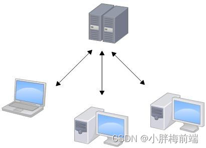
>
>
>
>
>
>那分布式版本控制系统与集中式版本控制系统有何不同呢？首先，分布式版本控制系统根本没有“中央服务器”，**每个人的电脑**上都是一个完整的版本库，这样，你工作的时候，就不需要联网了，因为版本库就在你自己的电脑上。既然每个人电脑上都有一个完整的版本库，那多个人如何协作呢？比方说你在自己电脑上改了文件A，你的同事也在他的电脑上改了文件A，这时，你们俩之间只需把各自的修改推送给对方，就可以互相看到对方的修改了。
>
>和集中式版本控制系统相比，分布式版本控制系统的**安全性要高**很多，因为每个人电脑里都有完整的版本库，某一个人的电脑坏掉了不要紧，随便从其他人那里复制一个就可以了。而集中式版本控制系统的中央服务器要是出了问题，所有人都没法干活了。
>
>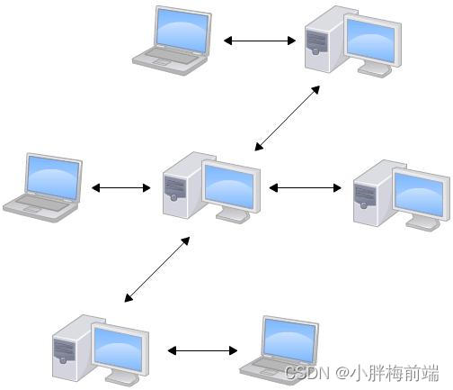
>

#### 3.3 作用
>
>版本控制软件在项目开发中作用重大，主要的功能有以下几点：  
>
>- 代码备份
>
>- 版本回退
>
>- 协作开发
>
>- 权限控制

## 二. Git使用

### 1. 安装Git

>[Git 官网 ](https://git-scm.com/)
>
>第一步：直接点击Download就可以进行下载，下载完成后，就可以“闭着眼睛”点击下一步了。
>
>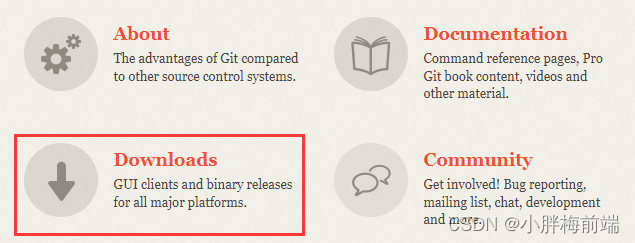
>
>安装完成后启动Windows命令行，输入`git --version`。即可查看安装版本。
>
>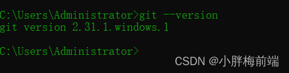
>
>第二步：在电脑桌面任意位置右击，打开Git Bash窗口：
>
>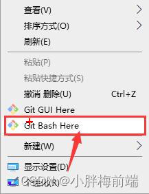
>
>第三步：配置Git账号和邮箱

### 2. Git推送内容到远程仓库的流程

>Git 作为分布式版本控制软件，存储文件的位置叫做**仓库**。仓库有**远程仓库**（互联网上一台服务器或局域网内的一台服务器）和**本地仓库**（本机的一个目录）两种。
>
>- 系统中任意文件夹都可以作为本地仓库。本地仓库需要先初始化，生成git基本配置。
>
>- 然后把本地的操作添加到缓存区。
>
>- 最后把缓存区操作提交到本地库。
>
>- 最后把本地库数据推送到远程仓库。
>
>  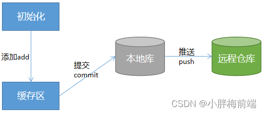

### 3. Git命令

#### 3.1 概述
>
>Git所有的命令语法： git 指令 xxx。
>
>我们在cmd窗口中输入各种git命令即可！
>

#### 3.2 全局设置
>
>第一次使用Git的时候，需要进行全局设置远程账号的用户名和邮箱，用于表示开发者的信息。因为Git是分布式版本控制系统，所以，每个机器都必须自报家门：你的名字和Email地址。
>
>设置自己的用户名：
>
>`git config --global user.name "Your Name"`
>
>设置自己的邮箱：
>
>`git config --global user.email "email@wxample.com"`
>
>配置成功后可以使用`git config -l`命令来查看配置信息。
>
>注意`git config`命令的`--global`参数，用了这个参数，表示你这台机器上所有的Git仓库都会使用这个配置
>

#### 3.3 创建本地仓库
>
>什么是版本库呢？版本库又名仓库，英文名repository，你可以简单理解成一个目录，这个目录里面的所有文件都可以被Git管理起来，每个文件的修改、删除，Git都能跟踪，以便任何时刻都可以追踪历史，或者在将来某个时刻可以“还原”。
>
>Git创建版本库的起始操作包括以下几个步骤：
>
>1）首先，选择一个合适的地方，创建一个空目录
>
>也不一定必须在空目录下创建Git仓库，选择一个已经有东西的目录也是可以的。不过，不建议你使用自己正在开发的公司项目来学习Git，否则造成的一切后果概不负责。
>
>2）右键->点击Git Bash Here启动命令行
>
>3）`git init`仓库初始化，把这个目录变成Git可以管理的仓库
>
>瞬间Git就把仓库建好了，而且告诉你是一个空的仓库（empty Git repository），细心的同学可以发现当前目录下多了一个.git的目录，这个目录是Git来跟踪管理版本库的，没事千万不要手动修改这个目录里面的文件，不然改乱了，就把Git仓库给破坏了。
>
>如果你没有看到.git目录，那是因为这个目录默认是隐藏的。
>
>4）创建一个初始化文件 index.html `touch index.html`
>
>5）`git add index.html`将文件加入到暂存区
>
>执行上面的命令，没有任何显示，这就对了，“没有消息就是好消息”，说明添加成功。
>
>6）`git commit -m '自定义注释信息'`提交到本地仓库 (m是message单词的缩写)，提交的说明可以是任意内容，当然最好是有意义的，这样你就可以从历史记录里方便的找到改动记录。
>
>为什么Git添加文件需要add，commit一共两步呢？因为commit可以一次提交很多文件，所以你可以多次add不同的文件，一次commit。
>
>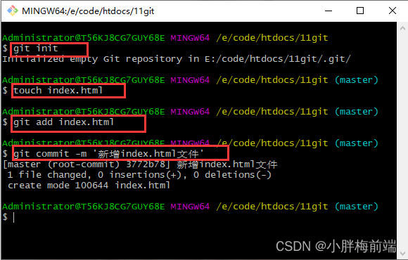
>
>***版本库的三个区域：***
>
>- 工作区（Working Directory）
>
>  就是你在电脑里能看到的目录，比如我的`learngit`文件夹就是一个工作区：
>
>  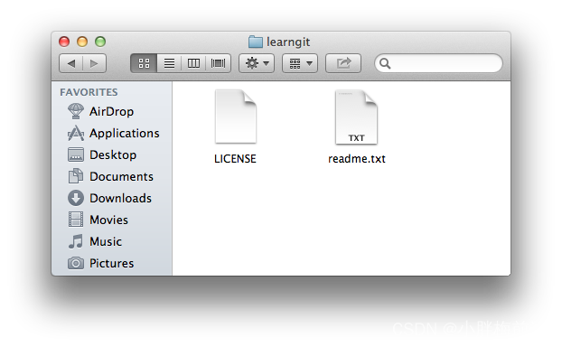
>
>- 暂存区
>
>工作区有一个隐藏目录`.git`，这个不算工作区，而是Git的版本库。
>
>Git的版本库里存了很多东西，其中最重要的就是称为stage（或者叫index）的暂存区，还有Git为我们自动创建的第一个分支`master`，以及指向`master`的一个指针叫`HEAD`。
>
>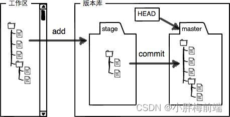
>
>- 本地仓库
>
>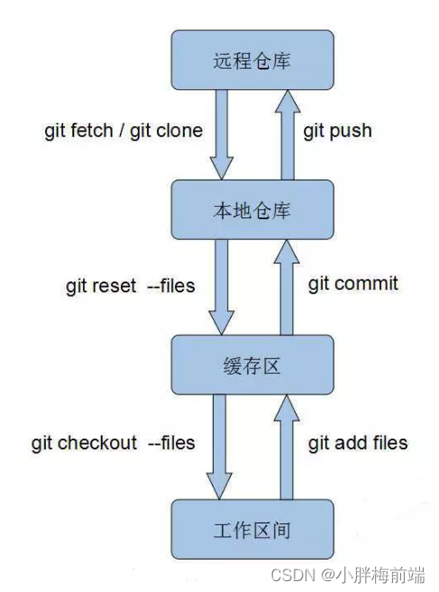
>
>***常用命令***
>
>```
>git init：初始化项目
>git add 文件名：把文件提交到暂存区
>git add -A：添加所有新文件到暂存区
>git add .：添加所有文件到暂存区
>git commit -m '自定义注释'：把暂存区的文件提交到本地仓库
>git status：版本状态查看
>	红色：表示文件状态不在暂存区和本地仓库
>	绿色：表示文件状态在暂存区不在本地仓库
>	nothing：表示工作区和本地仓库同步
>ls：查看工作区的文件状态 (list)
>git ls-files：查看暂存区的状态
>touch 文件名：新建文件到工作区
>clear:清空命令窗口(ctrl+l)
>```
>

#### 3.4 小结
>
>现在总结一下学的两点内容：
>
>- 初始化一个Git仓库，使用`git init`命令。
>
>- 添加文件到Git仓库，分两步：
>
>  - 使用命令`git add file`，注意，可反复多次使用，添加多个文件；
>
>  - 使用命令`git commit -m "message"`，完成。

### 4. 历史版本回滚

>就好比玩RPG游戏时，每通过一关就会自动把游戏状态存盘，如果某一关没过去，你还可以选择读取前一关的状态。有些时候，在打Boss之前，你会手动存盘，以便万一打Boss失败了，可以从最近的地方重新开始。Git也是一样，每当你觉得文件修改到一定程度的时候，就可以“保存一个快照”，这个快照在Git中被称为commit。一旦你把文件改乱了，或者误删了文件，还可以从最近的一个commit恢复，然后继续工作，而不是把几个月的工作成果全部丢失。

#### 4.1 回滚
>
>1）查看历史记录
>
>在实际工作中，我们脑子里怎么可能记得一个几千行的文件每次都改了什么内容，不然要版本控制系统干什么。版本控制系统肯定有某个命令可以告诉我们历史记录，在Git中，我们用`git log`命令查看：`git log`命令显示从最近到最远的提交日志
>
>```
>git log：返回详细的历史记录
>git log --oneline：返回简写的历史记录				
>```
>
>>如果内容偏多,需要使用方向键上下滚动，按q退出
>>
>>需要友情提示的是，你看到的一大串类似`1094adb...`的是`commit id`（版本号）
>
>2）根据版本号回滚
>
>```
>git reset --hard 3772b78 
>git reset --hard HEAD^
>```
>
>>进行版本回退时，不需要使用完整的哈希字符串，前七位即可
>>
>>版本切换之前，要提交当前的代码状态到仓库
>>
>>上一个版本就是`HEAD^`，上上一个版本就是`HEAD^^`，
>
>3）找不到版本号的情况
>
>现在，你回退到了某个版本，关掉了电脑，第二天早上就后悔了，想恢复到新版本怎么办？找不到新版本的`commit id`怎么办？在Git中，总是有后悔药可以吃的。Git提供了一个命令`git reflog`用来记录你的每一次命令：
>
>查看所有的操作记录
>
>```
>git reflog
>```
>

#### 4.2 小结
>
>- HEAD指向的版本就是当前版本，因此，Git允许我们在版本的历史之间穿梭，使用命令`git reset --hard commit_id`。
>
>- 穿梭前，用`git log`可以查看提交历史，以便确定要回退到哪个版本。
>
>- 要重返未来，用`git reflog`查看命令历史，以便确定要回到未来的哪个版本。

### 5. 删除仓库内容

>Git跟踪并管理的是修改，而非文件。
>
>你会问，什么是修改？比如你新增了一行，这就是一个修改，删除了一行，也是一个修改，更改了某些字符，也是一个修改，删了一些又加了一些，也是一个修改，甚至创建一个新文件，也算一个修改。
>
>在Git中，删除也是一个修改操作，我们实战一下，先添加一个新文件test.html到Git并且提交：
>
>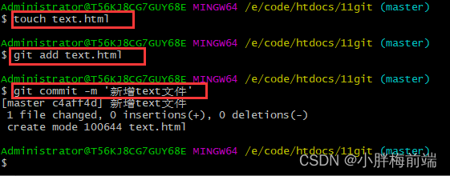
>
>一般情况下，你通常直接在文件管理器中把没用的文件删了，或者用`rm`命令删了：
>
>```
>rm text.html
>```
>
>这个时候，Git知道你删除了文件，因此，工作区和版本库就不一致了，`git status`命令会立刻告诉你哪些文件被删除了：
>
>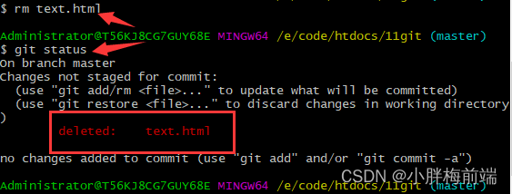
>
>现在你有两个选择，一是确实要从版本库中删除该文件，那就用命令`git rm`删掉，并且`git commit`提交：
>
>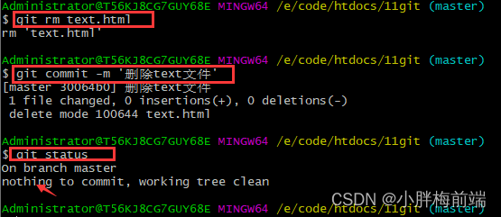
>
>现在，文件就从版本库中被删除了。
>
>另一种情况是删错了，因为版本库里还有呢，所以可以很轻松地把误删的文件恢复到最新版本：
>
>```
>git checkout -- 文件名
>```
>
>>`git checkout`其实是用版本库里的版本替换工作区的版本，无论工作区是修改还是删除，都可以“一键还原”。
>>
>>注意：从来没有被添加到版本库就被删除的文件，是无法恢复的！

### 6. 分支(Branch)

>分支就是科幻电影里面的平行宇宙，当你正在电脑前努力学习Git的时候，另一个你正在另一个平行宇宙里努力学习SVN。
>
>如果两个平行宇宙互不干扰，那对现在的你也没啥影响。不过，在某个时间点，两个平行宇宙合并了，结果，你既学会了Git又学会了SVN！
>
>分支是Git重要的功能特性之一，开发人员可以在主开发线的基础上分离出新的开发线。
>
>
>

#### 6.1 查看分支
>
>`git branch`命令会列出所有分支，当前分支前面会标一个`*`号。
>
>在版本回退里，你已经知道，每次提交，Git都把它们串成一条时间线，这条时间线就是一个分支。截止到目前，只有一条时间线，在Git里，这个分支叫主分支，即`master`分支。
>
>```
>git branch
>```
>

#### 6.2 创建分支
>
>```
>git branch 分支名称
>```

#### 6.3 切换分支
>
>```
>git checkout 分支名称
>```
>
>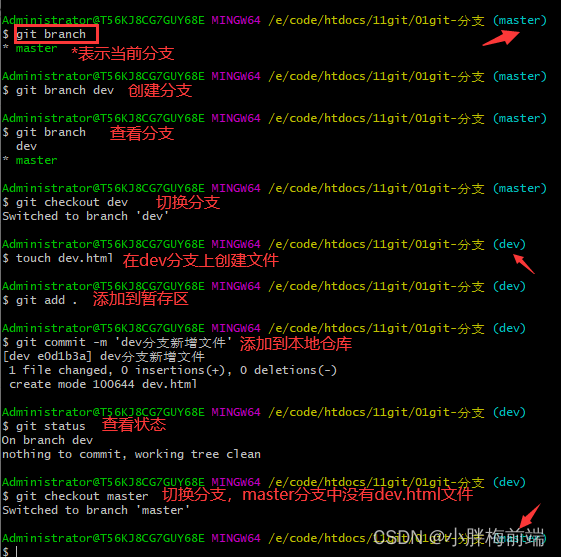
>
>
>

#### 6.4 创建并切换分支
>`git checkout`命令加上`-b`参数表示创建并切换
>
>```
>git checkout -b 分支名
>```

#### 6.5 删除分支

>```
>git branch -d 分支名
>```

#### 6.6 合并分支

>```
>git merge 分支名
>```
>
>>注意：**每次在切换分之前，提交一下当前分**
>>
>>注意：**合并分支之前需要切换到主分支**

####  6.7 Switch

>最新版本的Git提供了新的`git switch`命令来切换分支：`git switch` 命令是 2.23 版本中新加入的命令
>
>直接切换到已有的`master`分支，可以使用：
>
>```
>git switch master
>```
>
>创建并切换到新的`dev`分支，可以使用：
>
>```
>git switch -c dev
>```
>
>使用新的`git switch`命令，比`git checkout`要更容易理解。
>
>检查当前的版本：
>
>```
>git --version
>```
>
>升级当前的git版本：
>
>```
>git update-git-for-windows
>```

####  6.8 小结

>Git鼓励大量使用分支：
>
>查看分支：**git branch**
>
>创建分支：**git branch 分支名称**
>
>切换分支：**git checkout 分支名称** 或者 **git switch 分支名称**
>
>创建+切换分支：**git checkout -b 分支名称** 或者 **git switch -c 分支名称**
>
>合并某分支到当前分支：**git merge 分支名称**
>
>删除分支：**git branch -d 分支名称**
>

### 7. 冲突

>当多个分支修改同一个文件时，合并分支的时候就会产生冲突，冲突的解决非常简单,将内容修改为最终想要的结果，然后继续执行git add与git commit就可以了

## 三. 远程仓库

### 1.  常见的远程仓库
#### 1.1 Github
>Github是目前全球最大的代码托管平台。也是Git官方指定的远程仓库。里面包含了全球很多开源项目。
>
>但是由于Github是国外的服务器，所以在国内（尤其网络不是很好的地方）在进行推送内容或拉取内容时的速度可能不是特别快。

#### 1.2 Gitee

>Gitee 中文名称码云。
>
>是国内目前最大的代码托管平台。号称中国版Github。是由开源中国推出的。
>
>近几年在选择远程仓库时Gitee常作为国内开发者首选。

### 2.  注册账号

#### 2.1 在Gitee上注册账号

>Gitee官网: [Gitee - 企业级 DevOps 研发效能平台](https://gitee.com/)

#### 2.2 在github上注册账号

>github网址:[GitHub: Let’s build from here · GitHub](https://github.com/)

### 3. Gitee

#### 3.1 创建SSH key链接Gitee

>本地Git仓库和GitHub仓库、Gitee之间的传输是通过SSH加密的
>
>1）启动命令窗口
>
>```
>window+R -- cmd
>```
>
>2）然后输入
>
>```
>ssh-keygen.exe
>```
>
>3）连着三次回车，生成秘钥文件(<kbd>windows</kbd>+<kbd>R</kbd>打开运行命令窗口，输入`.`进入目录。`.ssh`文件夹)
>
>4）找到目录对应的id_rsa.pub公钥这个文件用记事本打开，复制里面的内容。
>
>5）登录Gitee仓库
>
>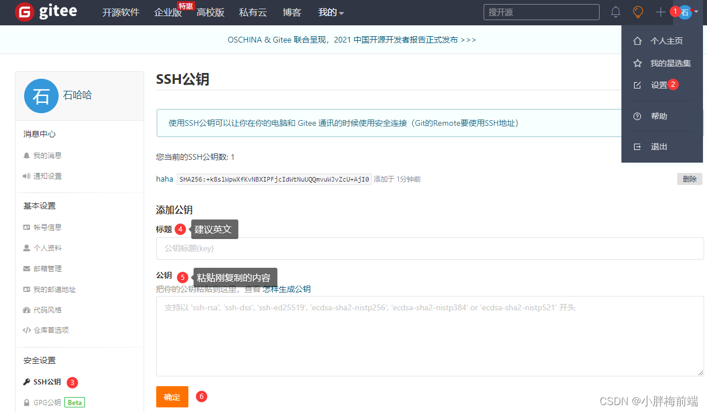
>
>>为什么GitHub、gitee需要SSH Key呢？因为GitHub、gitee需要识别出你推送的提交确实是你推送的，而不是别人冒充的，而Git支持SSH协议，所以，GitHub、gitee只要知道了你的公钥，就可以确认只有你自己才能推送。
>>
>>当然，GitHub、gitee允许你添加多个Key。假定你有若干电脑，你一会儿在公司提交，一会儿在家里提交，只要把每台电脑的Key都添加到GitHub、gitee，就可以在每台电脑上往GitHub、gitee推送了。

#### 3.2 在Gitee上创建仓库

>现在的情景是，你已经在本地创建了一个Git仓库后，又想在GitHub、gitt创建一个Git仓库，并且让这两个仓库进行远程同步，这样，GitHub、gitee上的仓库既可以作为备份，又可以让其他人通过该仓库来协作，真是一举多得。
>
>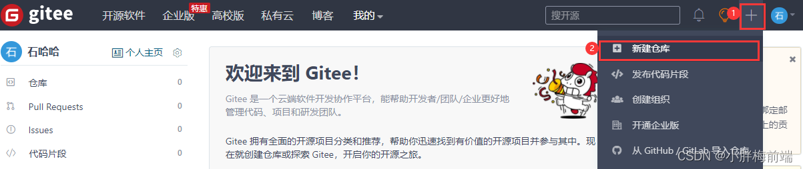

#### 3.3 Gitee提交远程仓库

>- 首次提交
>
>1）初始化
>
>```
>git init
>```
>
>2）添加所有文件到暂存区
>
>```
>git add .
>```
>
>3）添加到本地仓库
>
>```
>git commit -m '提示'
>```
>
>4）关联远程仓库
>
>```
>git remote add origin 路径
>```
>
>5）将本地仓库内容推送到远程仓库
>
>```
>git push -u origin "master"
>```
>
>>//说明
>>push：推送
>>-u：关联，加上了-u参数，Git不但会把本地的master分支内容推送的远程新的master分支，还会把本地的master分支和远程的master分支关联起来，在以后的推送或者拉取时就可以简化命令：git push
>>origin：远程仓库的别名，关联一个远程库时必须给远程库指定一个名字，origin是默认习惯命名
>>master：本地仓库的分支
>
>- 再次提交远程仓库
>
>```
>git add .
>git commit -m '提示信息'
>git push
>```

#### 3.4 Gitee下载远程仓库代码

> ```
> git clone https://gitee.com/XXX/XXX.git
> ```

#### 3.5 分支管理

>1）查看本地分支
>
>```
>git branch
>```
>
>2）查看远程分支
>
>```
>git branch -r
>```
>
>3）查看所有分支
>
>```
>git branch -a
>```
>
>4）拉取远程分支
>
>```
>git pull//更新 
>```
>
>5）创建本地分支
>
>```
>git branch 分支名称
>```
>
>6）切换本地分支
>
>```
>git checkout 分支名称
>```
>
>7）创建并切换本地分支
>
>```
>git checkout -b 分支名称
>```
>
>8）把远程分支同步到本地
>
>```
>git checkout -b 本地分支名称 origin/远程分支名称
>```
>
>9）把本地分支同步到远程
>
>```
>git push origin head:分支名称
>```
>
>10）删除本地分支
>
>```
>git branch -d 分支名称
>```
>
>11）删除远程分支
>
>```
>git push origin --delete 分支名称
>```
>
>12）合并本地分支(合并前要先切回要并入的分支)
>
>```
>git merge 要合并的分支名称
>```
>
>13）提交变更到自己的远程仓库
>
>```
>git push origin master
>```

#### 3.6 多人合作

>1）首先，可以试图用git push origin <branch-name>推送自己的修改；
>
>2）如果推送失败，则因为远程分支比你的本地更新，需要先用git pull试图合并；
>
>3）如果合并有冲突，则解决冲突，并在本地提交；
>
>4）没有冲突或者解决掉冲突后，再用git push origin <branch-name>推送就能成功！
>
>如果git pull提示no tracking information，则说明本地分支和远程分支的链接关系没有创建，用命令git branch --set-upstream-to <branch-name> origin/<branch-name>。
>
>这就是多人协作的工作模式。

### 4. GitHub

#### 4.1 创建SSH key链接GitHub

>本地Git仓库和GitHub仓库、Gitee之间的传输是通过SSH加密的
>
>1）启动命令窗口
>
>```
>window+R -- cmd
>```
>
>2）然后输入
>
>```
>ssh-keygen.exe
>```
>
>3）连着三次回车，生成秘钥文件(<kbd>windows</kbd>+<kbd>R</kbd>打开运行命令窗口，输入`.`进入目录。`.ssh`文件夹)
>
>4）找到目录对应的id_rsa.pub公钥这个文件用记事本打开，复制里面的内容。
>
>5）登录GitHub仓库
>
>>打开`settings`找到`SSH Key`页面，点击`New SSH Key`， 填上标题，同时在Key文本框中粘贴`id_rsa.pub`文件的公钥内容
>>
>>点击`Add SSH key`之后会跳转到输入密码的界面，我们需要输入GitHub密码来继续
>>
>>接下来我们就可以看到我们新加的SSH key了

#### 4.2 在GitHub上创建仓库

>需求是：我们有本地的Git仓库，又想在GitHub中创建一个Git仓库，并且希望这两个仓库进行远程同步，这样GitHub的仓库别人就可以来写作了。
>
> 1）在GitHub上创建一个仓库，在页面右上角`➕`号选择新的仓库（New repository）；
>
>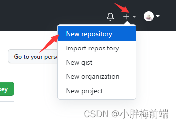
>
>2）填入仓库名称就可以了，直接点创建，如下
>
>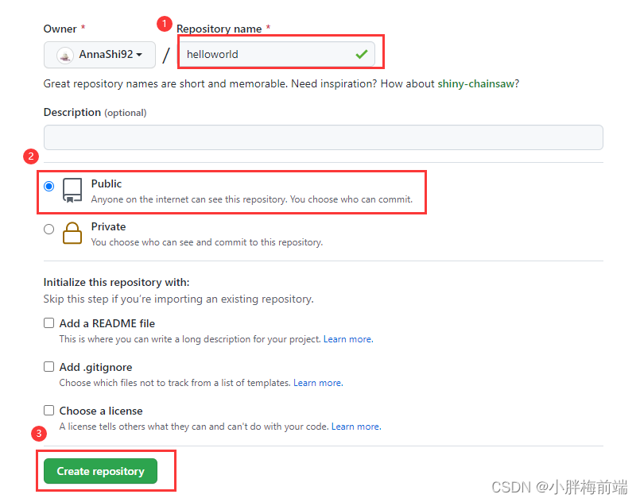
>
>3）这时候一个新的仓库就建立完成了，目前这个仓库还是空的
>
>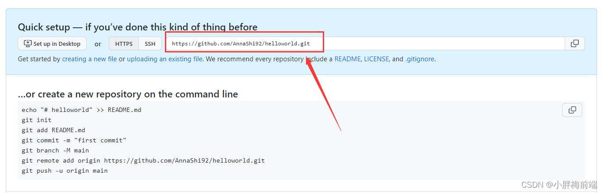
>
>4）页面提示说，我们可以有多种方法初始化这个仓库，我们按照给出的提示在本地仓库中运行下面的命令
>
>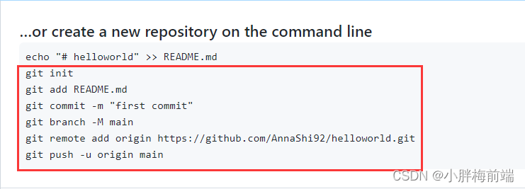
>
>因为远程库是空的，第一次推送`main`增加一个-u参数，这样Git不仅仅会把本地的main分支的内容推送到远程GitHub仓库中新的main分支，还会把本地的main分支和远程的main分支关联起来，在以后的推送和拉取就可以简化命令了。
>

### 5. 关联多个远程仓库

>有的小伙伴又要问了，一个本地库能不能既关联GitHub，又关联Gitee呢？
>
>答案是肯定的，因为git本身是分布式版本控制系统，可以同步到另外一个远程库，当然也可以同步到另外两个远程库。
>
>使用多个远程库时，我们要注意，git给远程库起的默认名称是origin，如果有多个远程库，我们需要用不同的名称来标识不同的远程库。
>
>查看远程库信息：
>
>```
>git remote -v
>```
>
>删除已有的远程库：
>
>```
>git remote rm origin
>```
>
>关联远程库：
>
>```
>//先关联GitHub的远程库，远程库的名称叫github，不叫origin了。
>git remote add github 路径
>//再关联Gitee的远程库,远程库的名称叫gitee，不叫origin。
>git remote add gitee 路径
>```
>
>如果要推送到GitHub，使用命令：
>
>```
>git push github master
>```
>
>如果要推送到Gitee，使用命令：
>
>```
>git push gitee master
>```
>
>这样一来，我们的本地库就可以同时与多个远程库互相同步：
>
>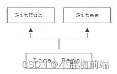


