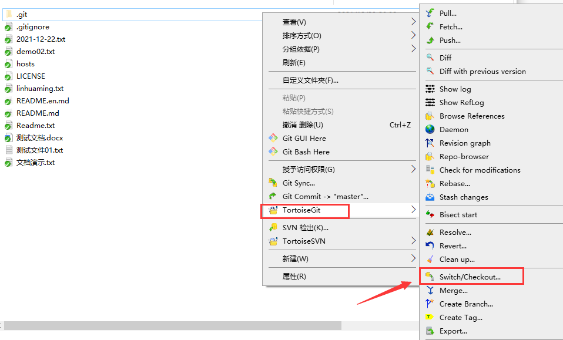

# TortoiseGit使用教程

## 1. 下载地址

>[TortoiseGit下载地址](https://tortoisegit.org/download/)
>
>

## 2. 建立仓库

>建立的方式有两种，如下所示
>- **git init 方式**
>  新建立一个git_demo 目录，然后右键点击 Git Create repository here ， 会自动生成一个.git 隐藏目录。
>   
>- **git clone 方式**
>  有右键点击Git Clone
>   
>   这时候会弹出一个框 ， URL 是远程仓库的地址，Directory 是存放在哪个目录下。
>   
>   

## 3. 提交代码

>  在刚才建立的仓库下，新建立一文件，这里的其他文件，是码云上面的(不用管)
>  
>  点击改文件右键，把新建的文件，添加在缓存区
>  
>  点击改文件右键，把暂存区的文件，添加到版本库
>  
>  填写完提交信息后，勾选该文件，点击commit 即可
>  
>  可在本地版本库，中查看刚才添加的文件
>  
>  
>  当文件添加到本地版本库后，就可以推送给远程仓库了，右键点击push ， 弹出框后ok即可
>  
>  

## 4. 更新代码

>  右键点击pull 即可
>  
>  

## 5. 回滚版本

>  右键点击 show log 后，选中某个版本右键点击 Reset master to this 即可
>  
>  再次回来，本地版本库中看，发现没有了刚才新建的 ”测试文件01.txt “
>  

## 6. 显示日志/修改日志

>  右键点击 show log 即可
>  
>  

## 7. 创建分支

>  右键点击Create Branch
>  
>  
>  切换到刚创建的b01分支
>  
>  

## 8. 解决冲突

>  为了演示冲突场景，需要新建另外一个目录，然后拉取远程仓库，在测试文件01.txt 中添加一些内容，需要提交到本地版本库，接着push 远程仓库。
>  
>  

与此同时，在别的仓库也是修改 ”测试文件01.txt“ ，添加内容，需要提交到本地版本库，接着push 远程仓库。

>  
>  发现push 不了，原因是发生冲突了，导致推送不了。
>  
>  接着我们pull 一下， 该文件是有感叹号图标的，说是该文件已经发生冲突了
>  
>  不要慌，接下面我们看是如何解决的，该文件右键点击Edit conflicts
>  
>  
>  知道原因之后，选择手动合并代码，最后点击Mark as resolved 即可
>  
>  
## 9. 忽略文件上传

>  有时候，不想上传某些文件到版本库中，就需要用到 git 的忽略功能了，新建一个文件
>  
>  接着会自动生成一个 忽略文件 .gitignore ， 文件里面内容是定义target.txt 不允许上传。
>  

 