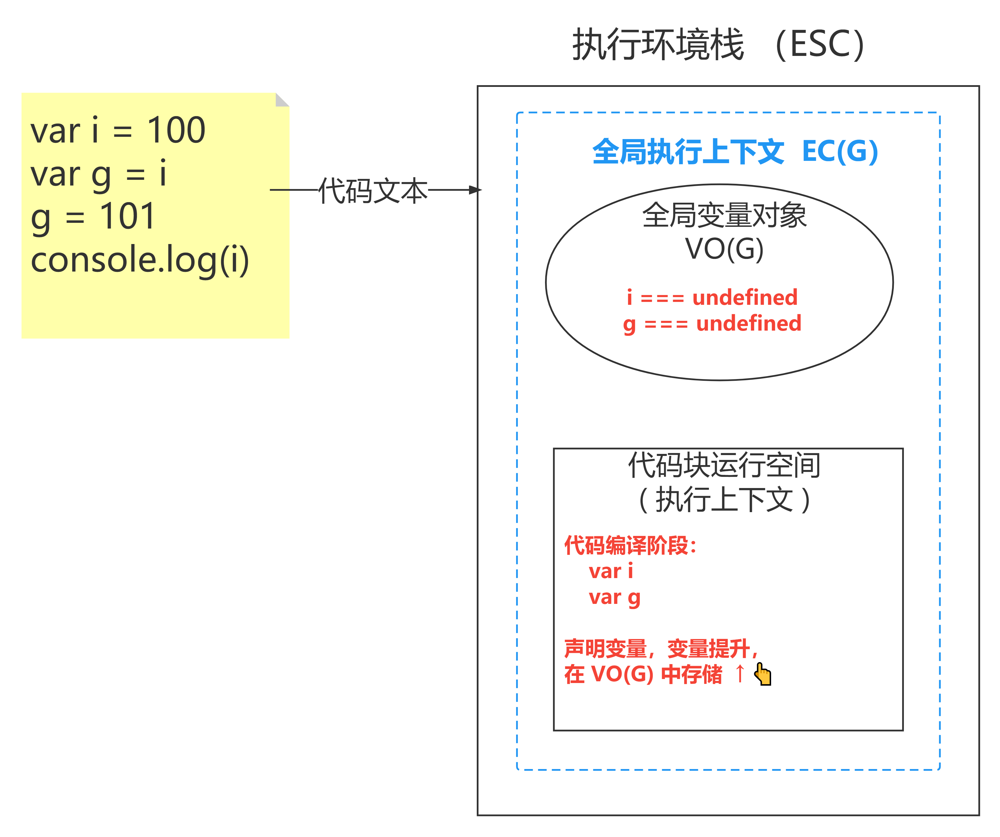

# JavaScript 关键知识梳理

## 内容概要

JavaScript 运行：基础语法规则、编译与执行阶段、运行环境

模块化：为什么需要模块化、模块化规范

运行堆栈：数据类型、高阶函数、闭包

面向对象：构造函数与 new 关键字、this 指向、原型及原型链  

异步编程：执行线程、EventLoop、Promise、Async/Await 


>**为什么要搞这些？因为每一个都是面试中会被问到的；**
>
>**为什么面试会问这些？因为这些就是验证 JS 能力的核心知识点；**


## JavaScript 运行

### 基础语法规则与运行环境 

变量的声明、数据类型、逻辑判断、函数声明与调用


执行平台有很多：不同的浏览器、Node、webview……

能运行 JS 的各种地方，在 JS 角度来看，就是各种 JS  **运行环境** 

我们的写的代码，实际都是一个字符，只不过，我们在写的时候，需要符合一定的书写规则，这就是 JS 的语法规则。代码的运行，需要先将代码文件中代码字符串读取并转译成机器码，存入内存中，CPU 在从内存中获取对应的数据进行运算获取结果。


### 编译与执行阶段

**编译阶段**：语法检查、变量的声明、函数的声明等……，函数先声明，变量后声明，因此，同名时，变量会替换函数。

**执行阶段**：变量的赋值、逻辑运算、函数调用等……


## 模块化

### 为什么需要模块化

命名冲突问题，团队协作困难。

JS 语言设计之初的考虑不周，语言设计级别的 Bug 

### 什么是模块化？

将一个大文件的功能块，写成小的功能块并在不同的代码文件中存储，使用导入导出的方式，互相连接；

### 模块化规范

CommonJS 与 ESM 为主流。AMD、UMD 基本已经推出历史舞台。

打包工具 ( webpack ) 的出现，就是在社区模块化出现之后，进行模块化打包的工具。顺便做了压缩，转移等工作

一个文件就是一个模块，模块与模块之间相互独立运行，拥有独立的运行空间，作用域相互隔离。

#### CommonJS 基本使用

CommonJS 目前主要在 Node 中被默认使用。

**导出方式**: 使用 `module.exports.xx = xx` 或者 `exports.xx =xx` ，`exports` 其实就是 `module.exprots` 的引用对象。

**导入方式**：使用 `require()` 方法

####  ESM 基本使用 

浏览器中需要在script标签中，添加属性 `type='module'` : `<script type="module"> ESM 代码 </script>`

Node 中使用 ESM 需要做出配置更改，更改方式有两种，任选其一即可：

1：修改文件后缀名为： `xx.mjs` 

2：在 packge.json 文件中添加配置选项：`type:'module'` 

**导出方式**: 使用 `export {xx}` 或者 `export default xxx` 

**导入方式**：使用 `import {xx} from 'xxx'`  


## 运行堆栈

### 高阶函数

在 JS 中，函数做为 第一等公民，与变量具有同等地位，函数不仅是一个可执行的代码段，还可以作为值进行传递；因此，函数所存储的代码段，就可以在任意地方调用，但是 **JS 中的函数永远在声明的地方执行** （词法作用域）

作为实参传入时，会形成一个 **回调函数** 

作为参数返回时，会形成一个 **闭包** 


### 堆栈执行

JS 代码的运行，是需要先向内存申请存储空间，然后存入内存后运行的。JS 申请的这部分内存，我们可以叫做 **执行环境栈（也被称为： ESC ）** 

在执行环境栈中，会先创建全局代码执行所需要的空间，这个空间叫做 **全局执行上下文 (也被称为 ECG )**，全局作用域中的声明和变量，会被存入**全局变量对象**中，也就是在全局执行上文中的一个空间，也被叫做 **VOG** 

在执行环境栈中，还会给不同的代码段 (函数、模块)，申请一个当前代码运行所需要的空间，这个空间叫做 **当前执行上下文** 。

而我们所使用**内置对象** ( JSON、setTimeout……）,会被存放在 **全局对象 ( 也叫 GO )** 中。

#### 简单模型的执行堆栈

```js
var i = 100
var g = i 
g = 101 
console.log(i)
```

 **编译阶段**



**执行阶段**


#### 对象模型的执行堆栈

```js
var i = {x:66}
var g = i
g.y = 77
console.log(i.y)
```

**编译阶段**


**执行阶段**


#### 函数模型的执行堆栈

**编译阶段**


**执行阶段-001**


**执行阶段-002**


### 闭包

[ MDN - 闭包 : https://developer.mozilla.org/zh-CN/docs/Web/JavaScript/Closures ](https://developer.mozilla.org/zh-CN/docs/Web/JavaScript/Closures)

> 一个函数和对其周围状态（**lexical environment，词法环境**）的引用捆绑在一起（或者说函数被引用包围），这样的组合就是**闭包**（**closure**）。也就是说，闭包让你可以在一个内层函数中访问到其外层函数的作用域。在 JavaScript 中，每当创建一个函数，闭包就会在函数创建的同时被创建出来。


#### 闭包解析


#### 闭包执行


1：闭包可以保存数据，也就是说如果我们想延长某些数据的生命，那么就可以放在闭包里。所以如果我们使用闭包保存大量的数据，必然对空间是一种消耗

2：闭包里的数据什么时候被回收呢？(没人用人的时候 GC（清洁工））

3：GC有它自己的工作周期 (GC就员V8当中的一个模块) 

4：GC并没有那么的智能，我们为了提高回收的效率在代码可以将一世后续无须再使用的数据置为 null  

```js
var lg = 1
function fun() {
  var lg = 2
  return function (a) {
    console.log(a + lg++);
  }
}
var f = fun()
f(3)
f(4)
f=null
```

5：回收不是一个变量名，名字是在栈区里的，回收的是这个名字所指向空间 


#### 闭包的练习题

```js
let m = 5
function foo(m) {
  return function (n) {
    console.log(n + (++m))
  }
}

let fn = foo(8)
fn(10)
foo(11)(13)
fn(20)
console.log(m)

// =================

let m = 10,
  n = 10
function foo(m) {
  foo = function (n) {
    console.log(m + n++)
  }
  console.log(m++)
}

foo(5)
foo(7)

```


> 西岭老湿

