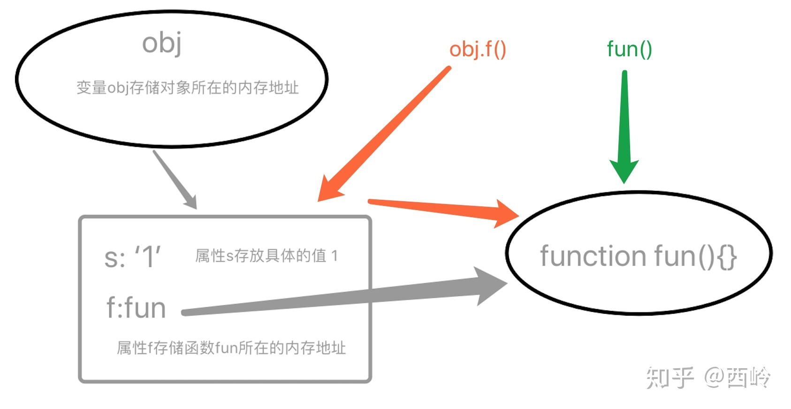
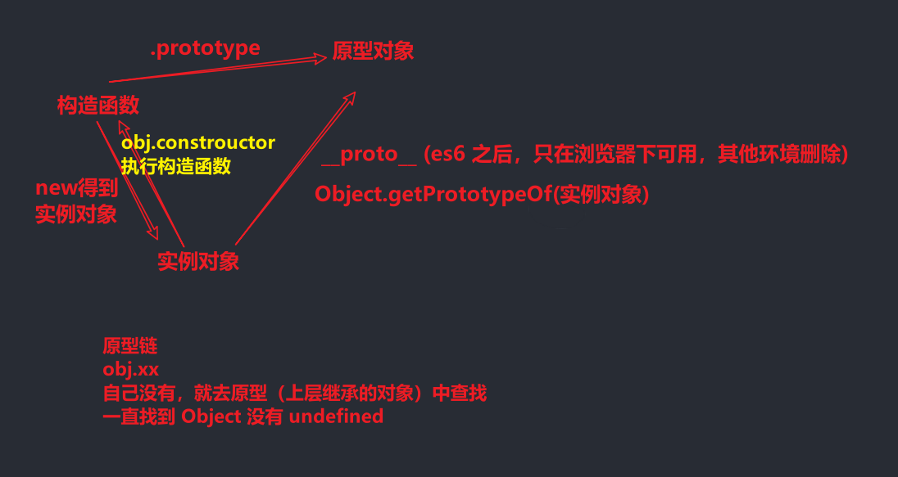

# JavaScript 关键知识梳理

## 内容概要

JavaScript 运行：基础语法规则、编译与执行阶段、运行环境 

模块化：为什么需要模块化、模块化规范 

运行堆栈：数据类型、高阶函数、闭包 

面向对象：构造函数与 new 关键字、this 指向、原型及原型链  

异步编程：执行线程、EventLoop、Promise、Async/Await 


>**为什么要搞这些？因为每一个都是面试中会被问到的；**
>
>**为什么面试会问这些？因为这些就是验证 JS 能力的核心知识点；**


## 面向对象 

### 普通函数与构造函数 

> 函数还是之前的函数，唯一的区别就是调用执行还是 new 

```js
function Foo(m, n) {
  let ret = m + n
  this.m = m
  this.n = n
  console.log(ret);
  return ret
}
console.log(new Foo(1,2));

// 01 普通函数调用
// let ret = Foo(10, 20)
// console.log(ret)

// 02 构造函数执行
// let res = new Foo(20, 20)
// console.log(res.ret)
```

**普通函数**

- 正常调用，不需要 new 关键字
- 执行过程还是按着堆栈执行 + 作用域链查找机制

**构造函数**

- 使用 new 关键字调用 
- 与普通函数类似，同样会创建私有上下文，然后进栈执行
- 执行 new 操作时，浏览器会创建一个空间表示空对象与 this 进行关联
- 函数体内如果没有 return 或者说 return 的是基本数据类型，默认返回对象实例
- 函数体内如果返回引用类型，那么就以自己返回为主
- 函数此时叫做类，返回的结果叫对象实例

**New 操作符**

- 正常情况下使用 new 完成对象实例创建，如果当前类不需要传递参数，则可以不加括号运行
- new Foo，未加小括号说明 FOO 不需要传参，称之为无参列表 
- new Foo 与 new Foo() 的优先级不同，`带括号的优先级高`  [运算符优先级](https://developer.mozilla.org/zh-CN/docs/Web/JavaScript/Reference/Operators/Operator_Precedence)
- 每一次 new 都会将函数重新执行，生成一个新的执行上下文，创建一个新的实例对象，因此两个实例对象不一样


### this 指向 

想要理解this，你可以先记住以下两点：

**1：this 永远指向一个对象；**

**2：this 的指向完全取决于函数调用的位置；**

针对以上的第一点特别好理解，不管在什么地方使用 this，它必然会指向某个对象；确定了第一点后，也引出了一个问题，就是 this 使用的地方到底在哪里，而第二点就解释了这个问题，但关键是在 JavaScript 语言之中，一切皆对象，运行环境也是对象，所以函数都是在某个对象下运行，而 this 就是函数运行时所在的对象（环境）。这本来并不会让我们糊涂，但是 JavaScript 支持运行环境动态切换，也就是说，this 的指向是动态的，很难事先确定到底指向哪个对象，这才是最让我们感到困惑的地方。

下面是一个实际的例子。

```js
function fun(){
    console.log(this.s);
}

var obj = {
    s:'1',
    f:fun
}

var s = '2';

obj.f(); //1
fun(); //2
```

上述代码中，fun 函数被调用了两次，显而易见的是两次的结果不一样；

很多人都会这样解释，obj.f() 的调用中，因为运行环境在 obj 对象内，因此函数中的 this 指向对象 obj；

而在全局作用域下调用 fun() ，函数中的 this 就会指向全局作用域对象 window 。

但是大部分人不会告诉你，**this 的指向为什么会发生改变，this指向的改变到底是什么时候发生的；**而搞懂了这些，this的使用才不会出现意外；

首先我们应该知道，在 JS 中，数组、函数、对象都是引用类型，在参数传递时也就是引用传递；

上面的代码中，obj 对象有两个属性，但是属性的值类型是不同的，在内存中的表现形式也是不同的；


调用时就成了这个样子：




因为函数在 js 中既可以当做值传递和返回，也可当做对象和构造函数，所有函数在运行时需要确定其当前的运行环境，this 就出生了，所以，this会根据运行环境的改变而改变，同时，函数中的this也只能在运行时才能最终确定运行环境；

再来看下面的代码，你可能会更加理解 this 对于运行环境的动态切换规则：

```javascript
var A = {
    name: '张三',
    f: function () {
        console.log('姓名：' + this.name);
    }
};

var B = {
    name: '李四'
};

B.f = A.f;
B.f()   // 姓名：李四
A.f()   // 姓名：张三
```

上面代码中，A.f 属性被赋给 B.f，也就是 A 对象将匿名函数的 **地址** 赋值给 B 对象；

那么在调用时，函数分别根据运行环境的不同，指向对象 A 和 B ；


```javascript
function foo() {
    console.log(this.a);
}
var obj2 = {
    a: 2,
    fn: foo
};
var obj1 = {
    a: 1,
    o1: obj2
};
obj1.o1.fn(); // 2
```

obj1对象的o1属性值是obj2对象的地址，而obj2对象的fn属性的值是函数foo的地址；

函数foo的调用环境是在obj2中的，因此this指向对象obj2;

 

那么接下来，我们对this使用最频繁的几种情况做一个总结，最常见的基本就是以下5种：

对象中的方法，事件绑定 ，构造函数 ，定时器，函数对象的call()、apply() 方法；

上面在讲解this原理是，我们使用对象的方法中的this来说明的，在此就不重复讲解了，不懂的同学们，请返回去重新阅读；

 

**构造函数中的this**

```javascript
functionPro(){
    this.x='1';
    this.y=function(){};
}
varp=newPro();
```


对于接触过 JS 面向对象编程的同学来说，上面的代码和图示基本都能看懂，new 一个构造函数并执行函数内部代码的过程就是这个五个步骤，当 JS 引擎指向到第3步的时候，会强制的将this指向新创建出来的这个对象；基本不需要理解，因为这本就是 JS 中的语法规则，记住就可以了；

### 模拟new实现

```js

// 给没有实例对象的原型添加了方法
Person.prototype.slogan = function(){
  console.log('嘿嘿');
}

Person.prototype.sayName = function(){
  console.log(this.name);
}

// var p1 = new Person('李四')
// p1.slogan()
// p1.sayName()

// 实现一个 new 函数，函数的返回值，就是一个新对象
function _new(Ctor,...params){
  // 1: 创建一个新的 空对象
  // let obj = {}
  // 2：将这个对象的原型，指向构造函数的 prototype 
  // obj.__proto__ = Ctor.prototype

  // 1+2  Object.create 方法，创建一个新对象，并将对象的原型指向 传入的对象
  let obj = Object.create(Ctor.prototype)

  // 3：将构造函数中的 this 执行当前这个新对象
  // 固定 this 的执行 bind call 
  // 4:调用执行函数代码
  let ret = Ctor.call(obj,...params)
  // 5:判断构造函数有没有返回值，有就用，没有，返回 obj 
  if(ret !== null && /^(object|function)$/.test(typeof ret)) return ret
  return obj
}

let p1 = _new(Person,'lisi')
p1.slogan()
p1.sayName()

```


### 原型及原型链



### 原型及原型链练习题

```js
function Foo() {
  this.m = 10
  this.n = 24
  this.getM = function () {
    console.log(this.m)
  }
}
Foo.prototype.getM = function () {
  console.log(this.m)
}

Foo.prototype.getN = function () {
  console.log(this.n)
}

let foo1 = new Foo
let foo2 = new Foo
console.log(foo1.getM === foo2.getM)  
console.log(foo1.getN === foo2.getN)
console.log(foo1.__proto__.getN === Foo.prototype.getN)  
console.log(foo1.__proto__.getM === foo2.getM) 
console.log(foo1.getM === Foo.prototype.getM) 
console.log(foo1.constructor) 
console.log(Foo.prototype.__proto__.constructor) 
foo1.getM()  
foo1.__proto__.getM() 
foo2.getN()  
Foo.prototype.getN() 
```


> 西岭老湿

