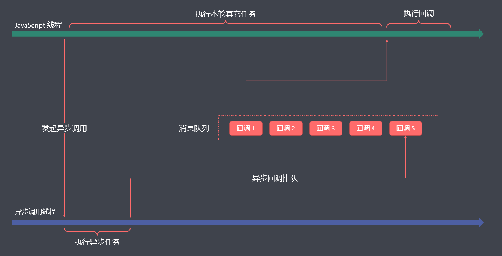

# JavaScript 关键知识梳理


## 异步编程

### 执行线程 

首先我们需要了解，JavaScript 代码的运行是单线程，采用单线程模式工作的原因也很简单，最早就是在页面中实现 Dom 操作，如果采用多线程，就会造成复杂的线程同步问题，如果一个线程修改了某个元素，另一个线程又删除了这个元素，浏览器渲染就会出现问题；

单线程的含义就是： JS执行环境中负责执行代码的线程只有一个；就类似于只有一个人干活；一次只能做一个任务，有多个任务自然是要排队的；

优点：安全，简单 

缺点：遇到任务量大的操作，会阻塞，后面的任务会长时间等待，出现假死的情况； 

====================

由 https://xiezuocat.com/  改写：

首先，我们要明白 JavaScript是以单线程方式运行的。使用单线程模型的理由也很简单，首先是在网页上进行 Dom操作，多线程的话，会导致线程的同步问题，比如一个线程对一个元素进行了修改，另外一个线程又把它删除，那么浏览器呈现就会有问题；

单线程意味着：在 JS运行环境中，仅有一个线程负责执行代码；这就像是一个人在工作。一次只能完成一项，多项工作当然要排队；

优势：安全、简便

缺点：在大量的工作中，会被卡住，之后的任务会延迟很长一段时间，导致假死。

==================


### EventLoop  事件轮询


#### 代码执行顺序

1. 浏览器加载界面之后会开启一个线程来执行 JS ，称之叫 JS 引擎（主线程）
2. JS引擎会自上而下执行 JS 代码，此过程会遇到（定时器，网络请求，事件绑定，promise 等语法）
3. 遇到上述代码之后，浏览器就会开始一个 Event Queue(任务|事件)队列， 优先级队结构
4. 在队列当中存在二个任务队列：微任务、宏任务
5. 最终会将遇到的异步任务存放到 Event Queue 队列中（等待执行）
6. 主线程会继续向下执行同步代码，直到所有的同步代码执行完成就会处理异步任务
7. 此时进入到 EventQueue 当中查找异步任务，找到之后放入到主线程中执行（此时主线程被占用）
8. 执行完一个异步任务之后，主线程再次空闲，此时再进入 EventQueue 查找余下的异步任务
9. 之后会循环上述的规则


先执行微任务（一轮当中只要有微任务就不会处理宏任务）

微任务（一般是谁先放置的谁先执行），宏任务（一般是谁先到的谁先执行）



#### 异步执行顺序示例代码解析

```js
setTimeout(() => {
  console.log('1')
}, 30)

console.log(2)

setTimeout(() => {
  console.log(3)
}, 20)

console.log(4)

console.time('AA')
// 消耗95ms
for (let i = 0; i < 88888888; i++) { }
console.timeEnd('AA')

console.log(5)

setTimeout(() => {
  console.log(6)
}, 18)

console.log(7)

setTimeout(() => {
  console.log(8)
}, 25)

console.log(9) 
// 结果：24579  31   68
```

当9输出之后，就意味着同步代码执行完了，所以我们就可以去事件队列中找是否有满足条件的异步任务因为是优先级队列，所以先看微任务队列，此时为空，没有，再去看宏任务，这个时候消息队列中肯定有了需要执行的异步任务。
对于宏任务来说，谁先到的谁先执行（谁先放的谁先执行）

#### 主线程占用时的异步执行机制

```js
// 死循环是将主线程彻底占用，其它所有事情不在处理
// 跑出异常只会影响下面的同步任务，已经放置在队列当中的任务会继续执行
setTimeout(() => {
  console.log(1)
}, 0)

console.log(2)
while (true) { }
// throw new Error('手动抛出异常')
// console.log(a)

console.log(3)

setTimeout(() => {
  console.log(4)
}, 10)
console.log(5)
```


**异步执行代码示例**

```js
function funSync() {
  setTimeout(() => {
    var timeback
    // 逻辑代码执行
    timeback = '异步执行结果'
    return timeback
  }, 2000);
}

var res = funSync()

console.log(res);

```

上面的代码，想要接受异步处理的结果，我们只能使用回调函数；

```js
function funSync(callBack) {
  setTimeout(() => {
    var timeback
    // 逻辑代码执行
    timeback = '异步执行结果'
    // return timeback
    callBack(timeback)
  }, 2000);
}

// 调用函数传入回调
funSync((res)=>{
  console.log(res);
})
```

但是，回调函数有两个弊端：

1：回调地狱 

2：调用与命名规范 


### Promise  

Promise 译为 承诺、许诺、希望，意思就是异步任务交给我来做，一定(承诺、许诺)给你个结果；从语法角度来说，Promise 就是一个对象或者叫容器，存放着一段代码(异步)的执行结果。

Promise 本身具有三种状态，状态的修改只能由异步执行结果决定，任何其他操作都不能修改promise的状态。在具体执行的过程中，Promise 的状态为 pending ，异步执行成功调用成功态的回调函数后，状态改变为 Fulfilled , 这就是承诺给你的结果，并将异步执行的结果传入回调函数；异步执行失败调用失败态的回调函数后，状态是 Rejected， 这就是承诺给你的结果，并将失败的原因(异常接管)传入回调函数；

Promise 对象的状态改变是不可逆的，且只有两种改变的可能：从 `pending` 变为 `fulfilled` 和从 `pending` 变为 `rejected` 。

基础语法规则和 API 这里就不再啰嗦了，可自行查看手册

#### Promise 对象

```js
// let p1 = new Promise(2)
// console.log(p1); // 报错

// new Promise 的时倾必须传入一个参数，且这个参数必须是一个函数
// 我们将这个函数称之为叫 executor 函数
// 这个函数接收二个参数(可选)，同时这个函数是立即执行的

let p1 = new Promise(()=>{})
console.log(p1); // 正确

```

#### executor 函数


### Promise 执行逻辑

1. 执行 new 操作时必须传入函数做为参数（executor函数）
   1. executor 函数接收两个函数做为参数，且该函数会立即执行
   2. executor 函数一般用于管控异步操作（书写异步代码）
2. new 操作执行之后会返回一个 Promise 实例 
   1. [[PromiseState]] promise 状态：pending（准备态） fulfilled(成功态) rejected(拒绝)
   2. [[PromiseResult]] promise值，默认的是undefined，一般用于存储存功的结果或者失败的原因 
   3. [[prototype]]：查找 Promise.prototype 原型，存在 then catch finally 三个常见的方法
3. 改变状态 
   1. 执行 resolve 控制实例的状态改变为成功态，传递的值是成功的结果
   2. 执行 reject 控制实例的状态改变为 rejected， 传递的值就是失败的结果
   3. 如果 executor 函数中的代码执行报错，则状态也会切换至失败态，报错原因就是 value 的值 
   4. 一旦状态从 pending 切到了 fulfilled 或者 rejected ，都无法再次改变其状态
4. 异步处理 
   1. new Promise 之后立即执行 executor 函数 
   2. 在 executor 函数中管理了一个异步编程代码，此时地状态是 pending 
   3. 当异步操作到达**执行时机**，开始执行时（看做是异步操作成功）通过调用 resolve 修改 promise 状态为 fulfilled
   4. 状态明确之后就可以执行后续的代码，成功态调用第一个方法，失败态调用第二个方法
5. 执行顺序
   1. 执行 new Promise 
   2. 执行 executor 函数：设置定时器，添加至异步宏任务
   3. 执行 then 操作注入两个方法（被注入的方法会保存起来，取决于 promise 状态）
   4. 同步代码完成，等待异步到达执行时机
   5. 执行定时器回调：调用 resolve 或者 reject 修改 promise 的状态和值
   6. 通知之前基于 then 注入的两个方法中的某一个执行 

#### Promise 执行逻辑示例

```js
let p1 = new Promise((resolve, reject) => {
  console.log(1)
  //! 异步操作
  setTimeout(() => {
    resolve('ok')
    console.log('2')
  }, 1000);
})

// 注入方法是同步的
// .then 是一个异步 微任务 ，但是它放到 事件队列 中的时机是有讲究的
p1.then((ret) => {
  console.log('成功态--->', ret)
}, (reason) => {
  console.log('失败态--->', reason)
})
console.log(3)

// 这道题有几个小点，一定要能的够说清楚它的执行过程
// 1：.then是个什么任务，什么时候放到队列中的 ？？？
// 上述代码的执行过程是一个最小模型，将来你遇到的复杂题都由它来


// 01 执行 new Promise 操作传入 executor 函数，函数会立即执行
// 02 executor 函数同步代码 1 会被输出，此后递到了 setTimeot() 操作，
//    这个时候会立即存放一个宏任务到事件队中 (走到这，你知道当前prom1se的状态吗？？？？ pending……)
//    ( promise 明确的状态指的要么是 fulfilled 要么是 rejected )
// 03 同步代码继续执行，遇到了 p1.then , 此后注入了二个函数，这二个函款将来
//    肯定都是异步的微任务，但是由于 promise 当前状态是不明确的，因此你可以认为这二个
//    函数对应的代码只是临时被存储起来了，还没有来得及往事件队列当中进行添加（与市面文章不太一样的地方）
// 04 同步代码再次执行，输出了 3【到此为止同步代码傲行了】
// 
// 05 去事件队列中查找是否有满足条件的异步任务，此时就无到了宏任务，将这个宏任务
//    当中的代码拿到了主线程中去运行，这个时候异步任务中的代码也是从上向下来执行 (执行本身依然是同步的)
// O6 先执行了 resolve('ok'), 这行代码一执行就意味着 promise 的状态明确了(成功)，所以会将 .then 注入的函
//    数立即存放到异步微任务队列当中 
// 07 同步代码继续执行，此时就输出了 2，【到此为止，本轮的同步代码又执行完了】
// 08 再次回到事件队列中查看是否有满足条件异步任务，此时看到了一个微任务，那么就将它拿到主线程中去执行
```


### Async/Await  

#### async 特点

- 用于修饰函数，默认让函数返回一个 promise 实例
- 如果函数执行报错，则 promise 状态为 rejected ，值为报错原因
- 如果函数执行正常则实例状态为 fulfilled，值为函数返回值，如果函数没有返回值则是 undefined 

```js
async function fun(){
  console.log(1);
}
var f = fun()
console.log(f);

// 1 
// Promise {<fulfilled>: undefined}
// [[Prototype]]: Promise
// [[PromiseState]]: "fulfilled"
// [[PromiseResult]]: undefined
```

```js
async function fun(){
  console.log(1);
  return 666
}
var f = fun()
console.log(f);

// 1 
// Promise {<fulfilled>: 666}
// [[Prototype]]: Promise
// [[PromiseState]]: "fulfilled"
// [[PromiseResult]]: 666
```

```js
async function fun(){
  console.log(a);
}
var f = fun()
console.log(f);

// Promise {<rejected>: ReferenceError: a is not defined
//   at fun (http://127.0.0.1:5500/promise.js:2:15)
//   at http://1…}[[Prototype]]: Promise[[PromiseState]]: "rejected"[[PromiseResult]]: ReferenceError: a is not defined
//   at fun (http://127.0.0.1:5500/promise.js:2:15)
//   at http://127.0.0.1:5500/promise.js:4:9
// promise.js:2 
      
//   Uncaught (in promise) ReferenceError: a is not defined
//   at fun (promise.js:2:15)
//   at promise.js:4:9
```


#### await 特点

- await 要基于 async 配合使用，一般不会单独使用 async 
- await 后面一般放置的是 promise 实例，如果不是，则会将它转为 new Promise.resolve() 处理
- await foo() 执行规则是会立即执行 foo 函数，接收 foo 的返回值然后处理为 promise 实例
- await 本身是一个异步微任务：把当前上下文中的  await 下面要执行的代码整体存储到异步微任务当中，当 await 后面的 promise 实例状态成功之后，再去执行下面的代码（也就是那个异步微任务）


### 异步面试题  

#### Promise 类型

```javascript
setTimeout(() => {
  console.log(1);
}, 0);

const first = ()=>
  new Promise((resolve,reject)=>{
    console.log(2);
    let p = new Promise((resolve,reject)=>{
      console.log(3);
      setTimeout(()=>{
        console.log(4);
        resolve(5)
      },0)
    })
    resolve(6)
    p.then(res=>{
      console.log((res));
    })
  })

first().then(res=>{
  console.log(res);
})

console.log(7);

// 2 3 first()调用，两个 promise 中的 executor 函数立即执行
// first().then 添加一个微任务
// 7  本轮调用栈，同步代码执行结束
// 6 开始执行外层promise的微任务，执行结束后，添加内层 promise 微任务(状态未确定),调用栈清空
// 1 执行宏任务，(两个 setTimeOut ),外层第一个先执行
// 4 执行第二个宏任务 内层 promise 的 setTimeOut,打印 4 之后，确定 Promise 状态
// 5 执行 p.then 微任务
// 结束 
```


#### async 类型

```javascript

async function async1() {
  console.log('1')
  await async2()
  console.log('2')
}
async function async2() {
  console.log('3')
}
console.log('4')
setTimeout(() => {
  console.log('5')
}, 0)
async1()
new Promise((resolve) => {
  console.log('6')
  resolve()
}).then(() => {
  console.log('7')
})
console.log('8')

// 4 1 3 6 8 2 7 5 

```


> 西岭老湿

