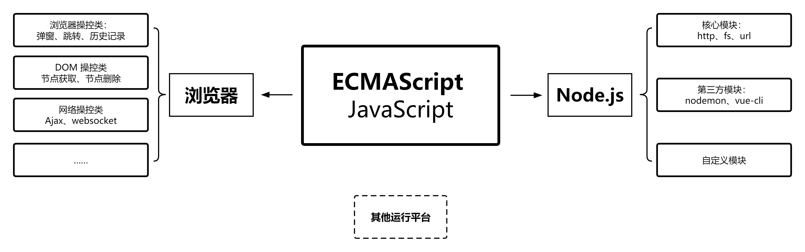
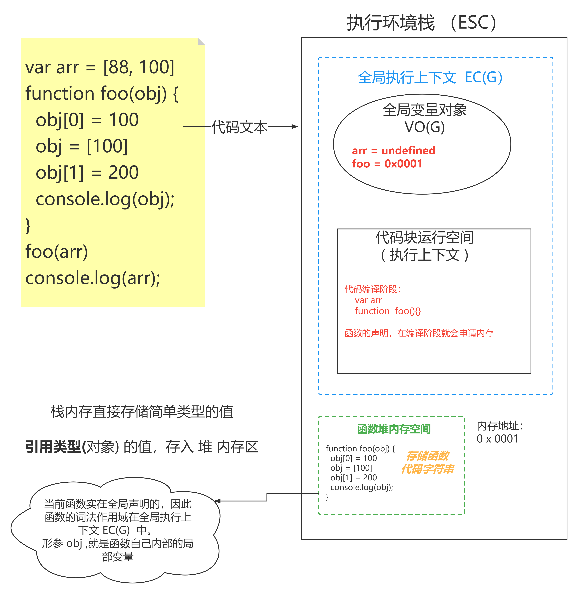
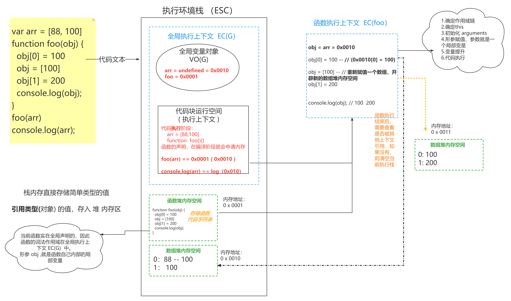
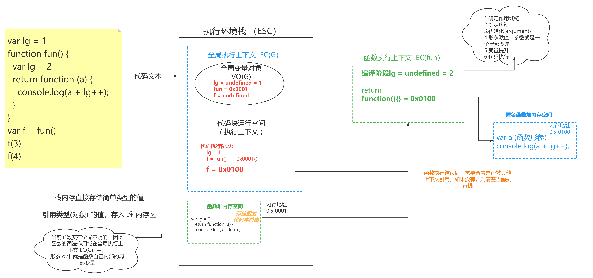
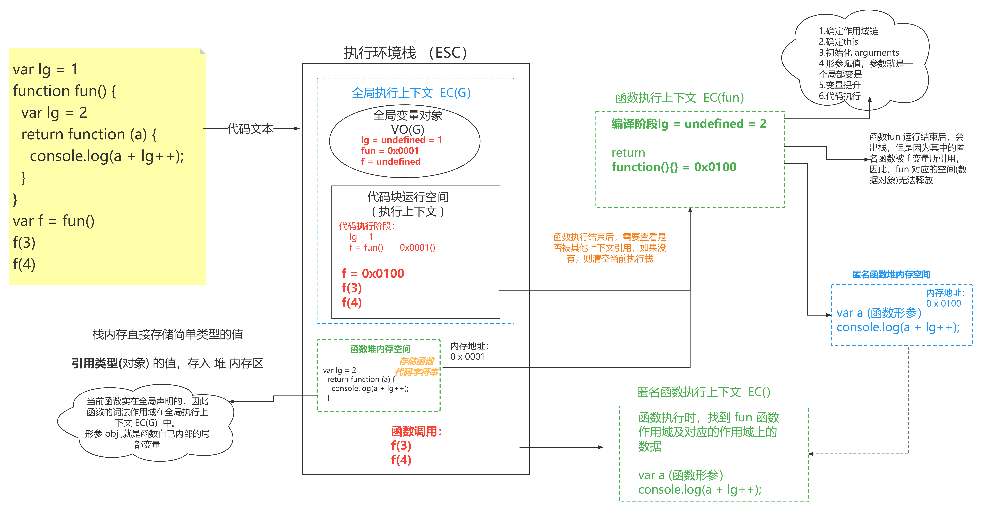
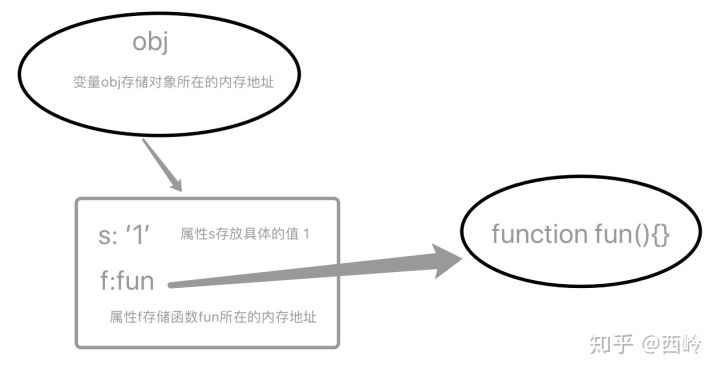
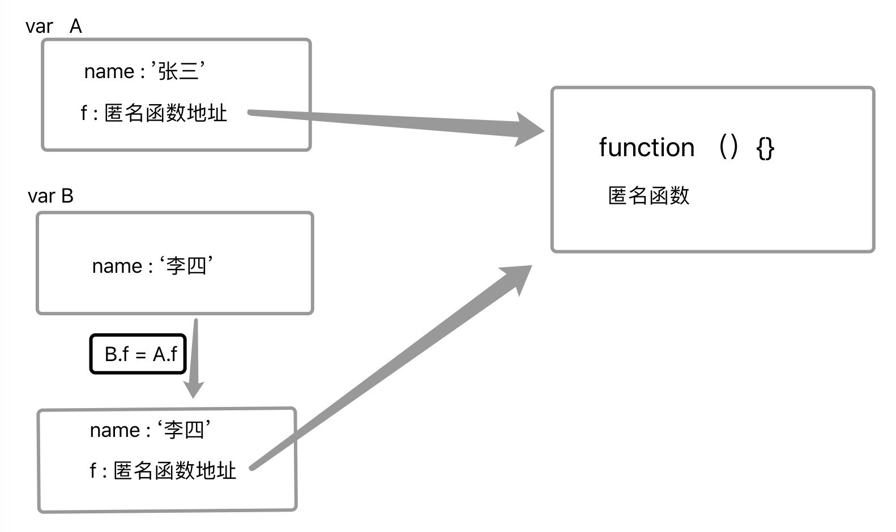

# JavaScript 关键知识梳理

## 内容概要

JavaScript 运行：基础语法规则、编译与执行阶段、运行环境

模块化：为什么需要模块化、模块化规范

运行堆栈：数据类型、高阶函数、闭包

面向对象：构造函数与 new 关键字、this 指向、原型及原型链  

异步编程：执行线程、EventLoop、Promise、Async/Await 


>**为什么要搞这些？因为每一个都是面试中会被问到的；**
>
>**为什么面试会问这些？因为这些就是验证 JS 能力的核心知识点；**


## JavaScript 运行

### 基础语法规则与运行环境 

变量的声明、数据类型、逻辑判断、函数声明与调用



执行平台有很多：不同的浏览器、Node、webview……

能运行 JS 的各种地方，在 JS 角度来看，就是各种 JS  **运行环境** 

我们的写的代码，实际都是一个字符，只不过，我们在写的时候，需要符合一定的书写规则，这就是 JS 的语法规则。代码的运行，需要先将代码文件中代码字符串读取并转译成机器码，存入内存中，CPU 在从内存中获取对应的数据进行运算获取结果。


### 编译与执行阶段

**编译阶段**：语法检查、变量的声明、函数的声明等……，函数先声明，变量后声明，因此，同名时，变量会替换函数。

**执行阶段**：变量的赋值、逻辑运算、函数调用等……


## 模块化

### 为什么需要模块化

命名冲突问题，团队协作困难。

JS 语言设计之初的考虑不周，语言设计级别的 Bug 

### 什么是模块化？

将一个大文件的功能块，写成小的功能块并在不同的代码文件中存储，使用导入导出的方式，互相连接；

### 模块化规范

CommonJS 与 ESM 为主流。AMD、UMD 基本已经推出历史舞台。

打包工具 ( webpack ) 的出现，就是在社区模块化出现之后，进行模块化打包的工具。顺便做了压缩，转移等工作

一个文件就是一个模块，模块与模块之间相互独立运行，拥有独立的运行空间，作用域相互隔离。

#### CommonJS 基本使用

CommonJS 目前主要在 Node 中被默认使用。

**导出方式**: 使用 `module.exports.xx = xx` 或者 `exports.xx =xx` ，`exports` 其实就是 `module.exprots` 的引用对象。

**导入方式**：使用 `require()` 方法

####  ESM 基本使用 

浏览器中需要在script标签中，添加属性 `type='module'` : `<script type="module"> ESM 代码 </script>`

Node 中使用 ESM 需要做出配置更改，更改方式有两种，任选其一即可：

1：修改文件后缀名为： `xx.mjs` 

2：在 packge.json 文件中添加配置选项：`type:'module'` 

**导出方式**: 使用 `export {xx}` 或者 `export default xxx` 

**导入方式**：使用 `import {xx} from 'xxx'`  


## 运行堆栈

### 高阶函数

在 JS 中，函数做为 第一等公民，与变量具有同等地位，函数不能是一个可执行的代码段，还可以作为变量进行传递；因此，函数所存储的代码段，就可以在任意地方调用，但是 **JS 中的函数永远在声明的地方执行** （词法作用域）

作为实参传入时，会形成一个 **回调函数** 

作为参数返回时，会形成一个 **闭包** 


### 堆栈执行

JS 代码的运行，是需要先向内存申请存储空间，然后存入内存后运行的。JS 申请的这部分内存，我们可以叫做 **执行环境栈（也被称为： ESC ）** 

在执行环境栈中，会先创建全局代码执行所需要的空间，这个空间叫做 **全局执行上下文 (也被称为 ECG )**，全局作用域中的声明和变量，会被存入**全局变量对象**中，也就是在全局执行上文中的一个空间，也被叫做 **VOG** 

在执行环境栈中，还会给不同的代码段 (函数、模块)，申请一个当前代码运行所需要的空间，这个空间叫做 **当前执行上下文** 。

而我们所使用**内置对象** ( JSON、setTimeout……）,会被存放在 **全局对象 ( 也叫 GO )** 中。

#### 简单模型的执行堆栈

```js
var i = 100
var g = i 
g = 101 
console.log(i)
```

 **编译阶段**


**执行阶段**


#### 对象模型的执行堆栈

```js
var i = {x:66}
var g = i
g.y = 77
console.log(i.y)
```

**编译阶段**


**执行阶段**


#### 函数模型的执行堆栈

**编译阶段**




**执行阶段-001**


**执行阶段-002**




### 闭包

[ MDN - 闭包 : https://developer.mozilla.org/zh-CN/docs/Web/JavaScript/Closures ](https://developer.mozilla.org/zh-CN/docs/Web/JavaScript/Closures)

> 一个函数和对其周围状态（**lexical environment，词法环境**）的引用捆绑在一起（或者说函数被引用包围），这样的组合就是**闭包**（**closure**）。也就是说，闭包让你可以在一个内层函数中访问到其外层函数的作用域。在 JavaScript 中，每当创建一个函数，闭包就会在函数创建的同时被创建出来。


#### 闭包解析



#### 闭包执行



1：闭包可以保存数据，也就是说如果我们想延长某些数据的生命，那么就可以放在闭包里。所以如果我们使用闭包保存大量的数据，必然对空间是一种消耗

2：闭包里的数据什么时候被回收呢？(没人用人的时候 GC（清洁工））

3：GC有它自己的工作周期 (GC就员V8当中的一个模块) 

4：GC并没有那么的智能，我们为了提高回收的效率在代码可以将一世后续无须再使用的数据置为 null  

```js
var lg = 1
function fun() {
  var lg = 2
  return function (a) {
    console.log(a + lg++);
  }
}
var f = fun()
f(3)
f(4)
f=null
```

5：回收不是一个变量名，名字是在栈区里的，回收的是这个名字所指向空间 


#### 闭包的练习题

```js
let m = 5
function foo(m) {
  return function (n) {
    console.log(n + (++m))
  }
}

let fn = foo(8)
fn(10)
foo(11)(13)
fn(20)
console.log(m)

// =================

let m = 10,
  n = 10
function foo(m) {
  foo = function (n) {
    console.log(m + n++)
  }
  console.log(m++)
}

foo(5)
foo(7)

```


## 面向对象 

### 普通函数与构造函数 

> 函数还是之前的函数，唯一的区别就是调用执行还是 new 

```js
function Foo(m, n) {
  let ret = m + n
  this.m = m
  this.n = n
  console.log(ret);
  return ret
}
console.log(new Foo(1,2));

// 01 普通函数调用
// let ret = Foo(10, 20)
// console.log(ret)

// 02 构造函数执行
// let res = new Foo(20, 20)
// console.log(res.ret)
```

**普通函数**

- 正常调用，不需要 new 关键字
- 执行过程还是按着堆栈执行 + 作用域链查找机制

**构造函数**

- 使用 new 关键字调用 
- 与普通函数类似，同样会创建私有上下文，然后进栈执行
- 执行 new 操作时，浏览器会创建一个空间表示空对象与 this 进行关联
- 函数体内如果没有 return 或者说 return 的是基本数据类型，默认返回对象实例
- 函数体内如果返回引用类型，那么就以自己返回为主
- 函数此时叫做类，返回的结果叫对象实例

**New 操作符**

- 正常情况下使用 new 完成对象实例创建，如果当前类不需要传递参数，则可以不加括号运行
- new Foo，未加小括号说明 FOO 不需要传参，称之为无参列表 
- new Foo 与 new Foo() 的优先级不同，`带括号的优先级高`  [运算符优先级](https://developer.mozilla.org/zh-CN/docs/Web/JavaScript/Reference/Operators/Operator_Precedence)
- 每一次 new 都会将函数重新执行，生成一个新的执行上下文，创建一个新的实例对象，因此两个实例对象不一样


### this 指向 

想要理解this，你可以先记住以下两点：

**1：this 永远指向一个对象；**

**2：this 的指向完全取决于函数调用的位置；**

针对以上的第一点特别好理解，不管在什么地方使用 this，它必然会指向某个对象；确定了第一点后，也引出了一个问题，就是 this 使用的地方到底在哪里，而第二点就解释了这个问题，但关键是在 JavaScript 语言之中，一切皆对象，运行环境也是对象，所以函数都是在某个对象下运行，而 this 就是函数运行时所在的对象（环境）。这本来并不会让我们糊涂，但是 JavaScript 支持运行环境动态切换，也就是说，this 的指向是动态的，很难事先确定到底指向哪个对象，这才是最让我们感到困惑的地方。

下面是一个实际的例子。

```js
function fun(){
    console.log(this.s);
}

var obj = {
    s:'1',
    f:fun
}

var s = '2';

obj.f(); //1
fun(); //2
```

上述代码中，fun 函数被调用了两次，显而易见的是两次的结果不一样；

很多人都会这样解释，obj.f() 的调用中，因为运行环境在 obj 对象内，因此函数中的 this 指向对象 obj；

而在全局作用域下调用 fun() ，函数中的 this 就会指向全局作用域对象 window 。

但是大部分人不会告诉你，**this 的指向为什么会发生改变，this指向的改变到底是什么时候发生的；**而搞懂了这些，this的使用才不会出现意外；

首先我们应该知道，在 JS 中，数组、函数、对象都是引用类型，在参数传递时也就是引用传递；

上面的代码中，obj 对象有两个属性，但是属性的值类型是不同的，在内存中的表现形式也是不同的；



调用时就成了这个样子：


因为函数在 js 中既可以当做值传递和返回，也可当做对象和构造函数，所有函数在运行时需要确定其当前的运行环境，this 就出生了，所以，this会根据运行环境的改变而改变，同时，函数中的this也只能在运行时才能最终确定运行环境；

再来看下面的代码，你可能会更加理解 this 对于运行环境的动态切换规则：

```javascript
var A = {
    name: '张三',
    f: function () {
        console.log('姓名：' + this.name);
    }
};

var B = {
    name: '李四'
};

B.f = A.f;
B.f()   // 姓名：李四
A.f()   // 姓名：张三
```

上面代码中，A.f 属性被赋给 B.f，也就是 A 对象将匿名函数的 **地址** 赋值给 B 对象；

那么在调用时，函数分别根据运行环境的不同，指向对象 A 和 B ；




```javascript
function foo() {
    console.log(this.a);
}
var obj2 = {
    a: 2,
    fn: foo
};
var obj1 = {
    a: 1,
    o1: obj2
};
obj1.o1.fn(); // 2
```

obj1对象的o1属性值是obj2对象的地址，而obj2对象的fn属性的值是函数foo的地址；

函数foo的调用环境是在obj2中的，因此this指向对象obj2;

 

那么接下来，我们对this使用最频繁的几种情况做一个总结，最常见的基本就是以下5种：

对象中的方法，事件绑定 ，构造函数 ，定时器，函数对象的call()、apply() 方法；

上面在讲解this原理是，我们使用对象的方法中的this来说明的，在此就不重复讲解了，不懂的同学们，请返回去重新阅读；

 

**构造函数中的this**

```javascript
functionPro(){
    this.x='1';
    this.y=function(){};
}
varp=newPro();
```


对于接触过 JS 面向对象编程的同学来说，上面的代码和图示基本都能看懂，new 一个构造函数并执行函数内部代码的过程就是这个五个步骤，当 JS 引擎指向到第3步的时候，会强制的将this指向新创建出来的这个对象；基本不需要理解，因为这本就是 JS 中的语法规则，记住就可以了；

### 模拟new实现

```js

// 给没有实例对象的原型添加了方法
Person.prototype.slogan = function(){
  console.log('嘿嘿');
}

Person.prototype.sayName = function(){
  console.log(this.name);
}

// var p1 = new Person('李四')
// p1.slogan()
// p1.sayName()

// 实现一个 new 函数，函数的返回值，就是一个新对象
function _new(Ctor,...params){
  // 1: 创建一个新的 空对象
  // let obj = {}
  // 2：将这个对象的原型，指向构造函数的 prototype 
  // obj.__proto__ = Ctor.prototype

  // 1+2  Object.create 方法，创建一个新对象，并将对象的原型指向 传入的对象
  let obj = Object.create(Ctor.prototype)

  // 3：将构造函数中的 this 执行当前这个新对象
  // 固定 this 的执行 bind call 
  // 4:调用执行函数代码
  let ret = Ctor.call(obj,...params)
  // 5:判断构造函数有没有返回值，有就用，没有，返回 obj 
  if(ret !== null && /^(object|function)$/.test(typeof ret)) return ret
  return obj
}

let p1 = _new(Person,'lisi')
p1.slogan()
p1.sayName()

```


### 原型及原型链


### 原型及原型链练习题

```js
function Foo() {
  this.m = 10
  this.n = 24
  this.getM = function () {
    console.log(this.m)
  }
}
Foo.prototype.getM = function () {
  console.log(this.m)
}

Foo.prototype.getN = function () {
  console.log(this.n)
}

let foo1 = new Foo
let foo2 = new Foo
console.log(foo1.getM === foo2.getM)  
console.log(foo1.getN === foo2.getN)
console.log(foo1.__proto__.getN === Foo.prototype.getN)  
console.log(foo1.__proto__.getM === foo2.getM) 
console.log(foo1.getM === Foo.prototype.getM) 
console.log(foo1.constructor) 
console.log(Foo.prototype.__proto__.constructor) 
foo1.getM()  
foo1.__proto__.getM() 
foo2.getN()  
Foo.prototype.getN() 
```


## 异步编程

### 执行线程 

首先我们需要了解，JavaScript 代码的运行是单线程，采用单线程模式工作的原因也很简单，最早就是在页面中实现 Dom 操作，如果采用多线程，就会造成复杂的线程同步问题，如果一个线程修改了某个元素，另一个线程又删除了这个元素，浏览器渲染就会出现问题；

单线程的含义就是： JS执行环境中负责执行代码的线程只有一个；就类似于只有一个人干活；一次只能做一个任务，有多个任务自然是要排队的；

优点：安全，简单

缺点：遇到任务量大的操作，会阻塞，后面的任务会长时间等待，出现假死的情况；


### EventLoop  事件轮询


#### 代码执行顺序

1. 浏览器加载界面之后会开启一个线程来执行 JS ，称之叫 JS 引擎（主线程）
2. JS引擎会自上而下执行 JS 代码，此过程会遇到（定时器，网络请求，事件绑定，promise 等语法）
3. 遇到上述代码之后，浏览器就会开始一个 Event Queue(任务|事件)队列， 优先级队结构
4. 在队列当中存在二个任务队列：微任务、宏任务
5. 最终会将遇到的异步任务存放到 Event Queue 队列中（等待执行）
6. 主线程会继续向下执行同步代码，直到所有的同步代码执行完成就会处理异步任务
7. 此时进入到 EventQueue 当中查找异步任务，找到之后放入到主线程中执行（此时主线程被占用）
8. 执行完一个异步任务之后，主线程再次空闲，此时再进入 EventQueue 查找余下的异步任务
9. 之后会循环上述的规则


先执行微任务（一轮当中只要有微任务就不会处理宏任务）

微任务（一般是谁先放置的谁先执行），宏任务（一般是谁先到的谁先执行）


#### 异步执行顺序示例代码解析

```js
setTimeout(() => {
  console.log('1')
}, 30)

console.log(2)

setTimeout(() => {
  console.log(3)
}, 20)

console.log(4)

console.time('AA')
// 消耗95ms
for (let i = 0; i < 88888888; i++) { }
console.timeEnd('AA')

console.log(5)

setTimeout(() => {
  console.log(6)
}, 18)

console.log(7)

setTimeout(() => {
  console.log(8)
}, 25)

console.log(9) 
// 结果：24579  31   68
```

当9输出之后，就意味着同步代码执行完了，所以我们就可以去事件队列中找是否有满足条件的异步任务因为是优先级队列，所以先看微任务队列，此时为空，没有，再去看宏任务，这个时候消息队列中肯定有了需要执行的异步任务。
对于宏任务来说，谁先到的谁先执行（谁先放的谁先执行）

#### 主线程占用时的异步执行机制

```js
// 死循环是将主线程彻底占用，其它所有事情不在处理
// 跑出异常只会影响下面的同步任务，已经放置在队列当中的任务会继续执行
setTimeout(() => {
  console.log(1)
}, 0)

console.log(2)
while (true) { }
// throw new Error('手动抛出异常')
// console.log(a)

console.log(3)

setTimeout(() => {
  console.log(4)
}, 10)
console.log(5)
```


**异步执行代码示例**

```js
function funSync() {
  setTimeout(() => {
    var timeback
    // 逻辑代码执行
    timeback = '异步执行结果'
    return timeback
  }, 2000);
}

var res = funSync()

console.log(res);

```

上面的代码，想要接受异步处理的结果，我们只能使用回调函数；

```js
function funSync(callBack) {
  setTimeout(() => {
    var timeback
    // 逻辑代码执行
    timeback = '异步执行结果'
    // return timeback
    callBack(timeback)
  }, 2000);
}

// 调用函数传入回调
funSync((res)=>{
  console.log(res);
})
```

但是，回调函数有两个弊端：

1：回调地狱 

2：调用与命名规范 


### Promise  

Promise 译为 承诺、许诺、希望，意思就是异步任务交给我来做，一定(承诺、许诺)给你个结果；从语法角度来说，Promise 就是一个对象或者叫容器，存放着一段代码(异步)的执行结果。

Promise 本身具有三种状态，且无法被外界所修改。在具体执行的过程中，Promise 的状态为 pending ，一旦有了结果，就会再次更改状态，异步执行成功的状态是 Fulfilled , 这就是承诺给你的结果，状态修改后，会调用成功的回调函数 onFulfilled 来将异步结果返回；异步执行失败的状态是 Rejected， 这就是承诺给你的结果，然后调用 onRejected 说明失败的原因(异常接管)；

Promise 对象的状态改变是不可逆的，且只有两种改变的可能：从 `pending` 变为 `fulfilled` 和从 `pending` 变为 `rejected` 。

基础语法规则和 API 这里就不再啰嗦了，可自行查看手册

#### Promise 对象

```js
// let p1 = new Promise(2)
// console.log(p1); // 报错

// new Promise 的时倾必须传入一个参数，且这个参数必须是一个函数
// 我们将这个函数称之为叫 executor 函数
// 这个函数接收二个参数(可选)，同时这个函数是立即执行的

let p1 = new Promise(()=>{})
console.log(p1); // 正确

```

#### executor 函数


### Promise 执行逻辑

1. 执行 new 操作时必须传入函数做为参数（executor函数）
   1. executor 函数接收两个函数做为参数，且该函数会立即执行
   2. executor 函数一般用于管控异步操作（书写异步代码）
2. new 操作执行之后会返回一个 Promise 实例 
   1. [[PromiseState]] promise 状态：pending（准备态） fulfilled(成功态) rejected(拒绝)
   2. [[PromiseResult]] promise值，默认的是undefined，一般用于存储存功的结果或者失败的原因 
   3. [[prototype]]：查找 Promise.prototype 原型，存在 then catch finally 三个常见的方法
3. 改变状态 
   1. 执行 resolve 控制实例的状态改变为成功态，传递的值是成功的结果
   2. 执行 reject 控制实例的状态改变为 rejected， 传递的值就是失败的结果
   3. 如果 executor 函数中的代码执行报错，则状态也会切换至失败态，报错原因就是 value 的值 
   4. 一旦状态从 pending 切到了 fulfilled 或者 rejected ，都无法再次改变其状态
4. 异步处理 
   1. new Promise 之后立即执行 executor 函数 
   2. 在 executor 函数中管理了一个异步编程代码，此时地状态是 pending 
   3. 当异步操作到达**执行时机**，开始执行时（看做是异步操作成功）通过调用 resolve 修改 promise 状态为 fulfilled
   4. 状态明确之后就可以执行后续的代码，成功态调用第一个方法，失败态调用第二个方法
5. 执行顺序
   1. 执行 new Promise 
   2. 执行 executor 函数：设置定时器，添加至异步宏任务
   3. 执行 then 操作注入两个方法（被注入的方法会保存起来，取决于 promise 状态）
   4. 同步代码完成，等待异步到达执行时机
   5. 执行定时器回调：调用 resolve 或者 reject 修改 promise 的状态和值
   6. 通知之前基于 then 注入的两个方法中的某一个执行 

#### Promise 执行逻辑示例

```js
let p1 = new Promise((resolve, reject) => {
  console.log(1)
  //! 异步操作
  setTimeout(() => {
    resolve('ok')
    console.log('2')
  }, 1000);
})

// 注入方法是同步的
// .then 是一个异步 微任务 ，但是它放到 事件队列 中的时机是有讲究的
p1.then((ret) => {
  console.log('成功态--->', ret)
}, (reason) => {
  console.log('失败态--->', reason)
})
console.log(3)

// 这道题有几个小点，一定要能的够说清楚它的执行过程
// 1：.then是个什么任务，什么时候放到队列中的 ？？？
// 上述代码的执行过程是一个最小模型，将来你遇到的复杂题都由它来


// 01 执行 new Promise 操作传入 executor 函数，函数会立即执行
// 02 executor 函数同步代码 1 会被输出，此后递到了 setTimeot() 操作，
//    这个时候会立即存放一个宏任务到事件队中 (走到这，你知道当前prom1se的状态吗？？？？ pending……)
//    ( promise 明确的状态指的要么是 fulfilled 要么是 rejected )
// 03 同步代码继续执行，遇到了 p1.then , 此后注入了二个函数，这二个函款将来
//    肯定都是异步的微任务，但是由于 promise 当前状态是不明确的，因此你可以认为这二个
//    函数对应的代码只是临时被存储起来了，还没有来得及往事件队列当中进行添加（与市面文章不太一样的地方）
// 04 同步代码再次执行，输出了 3【到此为止同步代码傲行了】
// 
// 05 去事件队列中查找是否有满足条件的异步任务，此时就无到了宏任务，将这个宏任务
//    当中的代码拿到了主线程中去运行，这个时候异步任务中的代码也是从上向下来执行 (执行本身依然是同步的)
// O6 先执行了 resolve('ok'), 这行代码一执行就意味着 promise 的状态明确了(成功)，所以会将 .then 注入的函
//    数立即存放到异步微任务队列当中 
// 07 同步代码继续执行，此时就输出了 2，【到此为止，本轮的同步代码又执行完了】
// 08 再次回到事件队列中查看是否有满足条件异步任务，此时看到了一个微任务，那么就将它拿到主线程中去执行
```


### Async/Await  

#### async 特点

- 用于修饰函数，默认让函数返回一个 promise 实例
- 如果函数执行报错，则 promise 状态为 rejected ，值为报错原因
- 如果函数执行正常则实例状态为 fulfilled，值为函数返回值，如果函数没有返回值则是 undefined 

```js
async function fun(){
  console.log(1);
}
var f = fun()
console.log(f);

// 1 
// Promise {<fulfilled>: undefined}
// [[Prototype]]: Promise
// [[PromiseState]]: "fulfilled"
// [[PromiseResult]]: undefined
```

```js
async function fun(){
  console.log(1);
  return 666
}
var f = fun()
console.log(f);

// 1 
// Promise {<fulfilled>: 666}
// [[Prototype]]: Promise
// [[PromiseState]]: "fulfilled"
// [[PromiseResult]]: 666
```

```js
async function fun(){
  console.log(a);
}
var f = fun()
console.log(f);

// Promise {<rejected>: ReferenceError: a is not defined
//   at fun (http://127.0.0.1:5500/promise.js:2:15)
//   at http://1…}[[Prototype]]: Promise[[PromiseState]]: "rejected"[[PromiseResult]]: ReferenceError: a is not defined
//   at fun (http://127.0.0.1:5500/promise.js:2:15)
//   at http://127.0.0.1:5500/promise.js:4:9
// promise.js:2 
      
//   Uncaught (in promise) ReferenceError: a is not defined
//   at fun (promise.js:2:15)
//   at promise.js:4:9
```


#### await 特点

- await 要基于 async 配合使用，一般不会单独使用 async 
- await 后面一般放置的是 promise 实例，如果不是，则会将它转为 new Promise.resolve() 处理
- await foo() 执行规则是会立即执行 foo 函数，接收 foo 的返回值然后处理为 promise 实例
- await 本身是一个异步微任务：把当前上下文中的  await 下面要执行的代码整体存储到异步微任务当中，当 await 后面的 promise 实例状态成功之后，再去执行下面的代码（也就是那个异步微任务）


### 异步面试题  

#### Promise 类型

```javascript
setTimeout(() => {
  console.log(1);
}, 0);

const first = ()=>
  new Promise((resolve,reject)=>{
    console.log(2);
    let p = new Promise((resolve,reject)=>{
      console.log(3);
      setTimeout(()=>{
        console.log(4);
        resolve(5)
      },0)
    })
    resolve(6)
    p.then(res=>{
      console.log((res));
    })
  })

first().then(res=>{
  console.log(res);
})

console.log(7);

// 2 3 first()调用，两个 promise 中的 executor 函数立即执行
// first().then 添加一个微任务
// 7  本轮调用栈，同步代码执行结束
// 6 开始执行外层promise的微任务，执行结束后，添加内层 promise 微任务(状态未确定),调用栈清空
// 1 执行宏任务，(两个 setTimeOut ),外层第一个先执行
// 4 执行第二个宏任务 内层 promise 的 setTimeOut,打印 4 之后，确定 Promise 状态
// 5 执行 p.then 微任务
// 结束 
```


#### async 类型

```javascript

async function async1() {
  console.log('1')
  await async2()
  console.log('2')
}
async function async2() {
  console.log('3')
}
console.log('4')
setTimeout(() => {
  console.log('5')
}, 0)
async1()
new Promise((resolve) => {
  console.log('6')
  resolve()
}).then(() => {
  console.log('7')
})
console.log('8')

// 4 1 3 6 8 2 7 5 

```


> 西岭老湿

