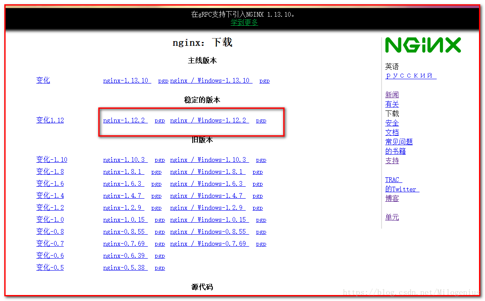
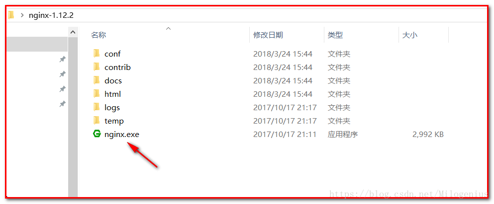
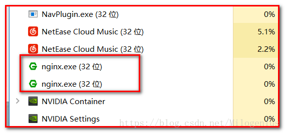
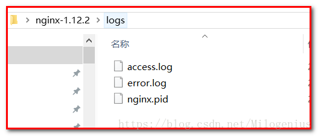

# Nginx下载及安装

## 一. 初识Nginx

>Nginx是一款轻量级的Web 服务器/反向代理服务器及电子邮件（IMAP/POP3）代理服务器，并在一个BSD-like 协议下发行。其特点是占有内存少，并发能力强，事实上nginx的并发能力确实在同类型的网页服务器中表现较好，中国大陆使用nginx网站用户有：百度、京东、新浪、网易、腾讯、淘宝等。

## 二. Nginx下载

>官方网址:http://nginx.org/en/download.html
>
>

## 三. Nginx启动

### 1. 可执行文件启动

>双击nginx.exe启动
>
>
>
>打开任务管理器,如果发现nginx进程存在,说明启动完成;
>
>

### 2. 命令行启动

>首先,我们进入nginx所在的文件夹,在地址栏敲击命令"cmd",最后按确认键,进入到命令行模式
>
>```
>#启动命令
>start nginx
>#检查命令
>nginx -t -c conf/nginx.conf
>```

## 四. Nginx基本控制

>要启动nginx，请运行可执行文件。一旦nginx启动，就可以通过调用带有-s参数的可执行文件来控制它。使用以下语法：
>
>```
>nginx -s stop - 快速关机
>nginx -s quit - 优雅的关机
>nginx -s reload - 重新加载配置文件
>nginx -s reopen - 重新打开日志文件
>```
>
>说明:如果在启动过程中未正常启动,可以去查看错误日志,根据其中报错信息寻找解决问题的方法;
>
>