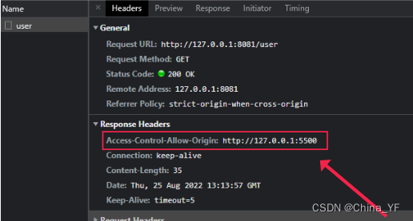

# 同源策略和跨域处理

## 一、为什么会出现跨域(同源策略)

>同源策略（Same Orgin Policy）是一种约定，它是浏览器核心也最基本的安全功能，它会阻止一个域的JS脚本和另外一个域的内容进行交互，如果缺少了同源策略，浏览器很容易受到XSS、CSFR等攻击(有同源策略，在设置不当时也会受到攻击)。所谓同源（即在同一个域）就是两个页面具有相同的协议（protocol）、主机（host）和端口号（port）。

##  二、什么是跨域

>跨域就是当在页面上发送ajax请求时，**由于浏览器同源策略的限制，要求当前页面和服务端必须同源，也就是协议、域名和端口号必须一致**。
>
>```
>http://www.abc.com:8080/api/getUserInfo
>协议://子域名.主域名:端口号/资源路径
>```
>
>
>
>
>
>如果协议、域名和端口号中有其中一个不一致，则浏览器视为跨域，进行拦截。
>
>
>
>|        当前页面url        |          被请求页面url          | 是否跨域 |             原因             |
>| :-----------------------: | :-----------------------------: | :------: | :--------------------------: |
>|   http://www.test.com/    | http://www.test.com/index.html  |    否    | 同源(协议、主机、端口号相同) |
>|   http://www.test.com/    | https://www.test.com/index.html |   跨域   |     协议不同(http/https)     |
>|   http://www.test.com/    |      http://www.baidu.com/      |   跨域   |     域名不同(test/baidu)     |
>|   http://www.test.com/    |      http://blog.test.com/      |   跨域   |     子域名不同(www/blog)     |
>| http://www.test.com:8080/ |    http://www.test.com:7001/    |   跨域   |    端口号不同(8080/7001)     |
>
>>跨域并不是请求发不出去，请求能发出去，服务端能收到请求并正常返回结果，只是结果被浏览器拦截了。你可能会疑问明明通过表单的方式可以发起跨域请求，为什么Ajax 就不会？因为归根结底，跨域是为了阻止用户读取到另一个域名下的内容，Ajax 可以获取响应，浏览器认为这不安全，所以拦截了响应。但是表单并不会获取新的内容，所以可以发起跨域请求。同时也说明了跨域并不能完全阻止 CSRF，因为请求毕竟是发出去了。

## 三、简单请求

>对于`HEAD`，`GET`，`POST`请求，如果HTTP请求头中只有`Accept`/`Accept-Language`/`Content-Language`/`Last-Event-ID`/`Content-Type`六种类型，且Content-Type只能是下面三个值，则是简单请求：
>
>- application/x-www-form-urlencoded 对应普通表单
>- multipart/form-data 对应文件上传
>- text/plain 对应文本发送(一般不怎么用)
>  简单请求会在发送时自动在 HTTP 请求头加上 Origin 字段，来标明当前是哪个源(协议+域名+端口)，服务端来决定是否放行。

## 四、预检请求

>非简单请求的CORS请求，会在正式通信之前，增加一次HTTP查询请求，称为"预检"请求（preflight）。"预检"请求用的请求方法是OPTIONS，表示这个请求是用来询问的。
>
>预检请求携带的头信息：
>
>- Origin，表示请求来自哪个源。
>- Access-Control-Request-Method 用来列出浏览器的CORS请求会用到哪些HTTP方法
>- Access-Control-Request-Headers 一个逗号分隔的字符串，指定浏览器CORS请求会额外发送的头信息字段

## 五、跨域解决方案

### 1. JSONP

>**jsonp的原理就是利用了script标签不受浏览器同源策略的限制，**然后和后端一起配合来解决跨域问题的。
>
>具体的实现就是在客户端创建一个script标签，然后把请求后端的接口拼接一个回调函数名称作为参数传给后端，并且赋值给script标签的src属性，然后把script标签添加到body中，当后端接收到客户端的请求时，会解析得到回调函数名称，然后把数据和回调函数名称拼接成函数调用的形式返回，客户端解析后会调用定义好的回调函数，然后在回调函数中就可以获取到后端返回的数据了。
>
>页面中可能会存在多个jsonp，所以可以封装一个jsonp方法，客户端代码如下：
>```html
><script>
>    // 封装一个jsonp函数
>    function jsonp({url, params, callback}) {
>        return new Promise((resolve, reject) => {
>            // 定义回调函数
>            window[callback] = function(data) {
>                resolve(data)
>            }
>          
>            const script = document.createElement('script') // 创建script标签
>            params = {...params, callback}
>            const arr = []
>            for(const key in params) {
>                if(params.hasOwnProperty(key)) { // 判断当前key是否是params对象自身的属性，有可能会是原型上的属性，所以需要判断一下
>                    arr.push(`${key}=${params[key]}`)
>                }
>            }
>            url += `?${arr.join('&')}` // 拼接参数
>            script.async = true
>            script.src = url
>            document.body.appendChild(script)
>            script.onload = () => {
>                document.body.removeChild(script)
>            }
>        })
>    }
>	// 使用jsonp
>    jsonp({
>        url: 'http://127.0.0.1:8081/user',
>        params:{id: '1'},
>        callback: 'getUserData'
>    }).then(res => {
>        console.log('res:', res)
>    })
></script>
>```
>
>服务端代码如下(nodeJS)：
>
>```javascript
>const http = require('http')
>const url = require('url')
>
>// 创建server
>const server = http.createServer()
>// 监听http请求
>server.on('request', (req, res) => {
>    // 获取客户端传来的回调函数名称
>    const {callback} = url.parse(req.url, true).query
>    const user = { // 模拟返回数据
>        id: 1, 
>        name: 'zhangsan',
>        age: 12
>    }
>    // 把数据和回调函数名称拼接成函数调用的方式返回
>    const result = `${callback}(${JSON.stringify(user)})`
>    res.end(result)
>})
>
>// 设置监听端口
>server.listen(8081, function() {
>    console.log('server is running on 8081 port！')
>})
>```
>
>**jsonp的优点就是兼容性好，可以解决主流浏览器的跨域问题，缺点是仅支持GET请求，不安全，可能遭受xss攻击。**

### 2. CORS


>cors是跨域资源共享，是一种基于 HTTP 头的机制，该机制通过允许服务器标示除了它自己以外的其它 origin（域，协议和端口），使得浏览器允许这些 origin 访问加载自己的资源。服务端设置了Access-Control-Allow-Origin就开启了CORS，所以这种方式只要后端实现了CORS，就解决跨域问题，前端不需要配置。
>
>服务端设置Access-Control-Allow-Origin响应头即可，服务端代码如下：
>
>```javascript
>const http = require('http')
>const url = require('url')
>// 创建server
>const server = http.createServer()
>// 定义跨域访问白名单
>const authOrigin = ['http://127.0.0.1:5500']
>
>// 监听http请求
>server.on('request', (req, res) => {
>    const user = { // 模拟返回数据
>        id: 1,
>        name: 'zhangsan',
>        age: 12
>    }
>    const origin = req.headers.origin
>    if (authOrigin.includes(origin)) {
>        // 添加响应头，实现cors
>        // res.setHeader('Access-Control-Allow-Origin', '*') // 允许所有的地址跨域访问
>        res.setHeader('Access-Control-Allow-Origin', origin) // 只有白名单中的地址才可以跨域访问
>    }
>    res.end(JSON.stringify(user))
>})
>
>// 设置监听端口
>server.listen(8081, function () {
>    console.log('server is running on 8081 port！')
>})
>```
>
>客户端代码如下：
>
>```html
><script>
>// fetch请求
>fetch('http://127.0.0.1:8081/user', {
>    method: 'POST',
>    body: JSON.stringify({
>        id: 1,
>    }),
>}).then((response) => response.json())
>    .then((json) => console.log(json));
></script>
>```
>
>当客户端访问时服务端接口时，就可以看到响应头中服务端配置的Access-Control-Allow-Origin：
>
>
>
>**CORS方式解决跨域问题比较常用，只需要后端配置响应头Access-Control-Allow-Origin，前端无需配置，实现简单。**

### 3. 代理服务器

>因为同源策略是浏览器限制的，所以**服务端请求服务器是不受浏览器同源策略的限制的**，因此我们可以搭建一个自己的node服务器来代理访问服务器。
>
>大概的流程就是：我们在客户端请求自己的node代理服务器，然后在node代理服务器中转发客户端的请求访问服务器，服务器处理请求后给代理服务器响应数据，然后在代理服务器中把服务器响应的数据再返回给客户端。**客户端和自己搭建的代理服务器之间也存在跨域问题，所以需要在代理服务器中设置CORS。**
>基本的工作流程如下：
>
>
>
>客户端代码如下：
>
>```html
><!-- 引入axios发送请求 -->
><script src="https://unpkg.com/axios/dist/axios.min.js"></script>
><script>
>    // 简单封装一个axios向代理服务器发送请求
>    function proxyAxios(data) {
>        return axios({
>            url: 'http://localhost:8081/proxyApi', // 请求自己搭建的node代理服务器的地址
>            method: 'POST',
>            headers: { 'content-type': 'application/x-www-form-urlencoded' },
>            data
>        })
>    }
>
>    // 使用node代理服务器向服务器发送请求(获取王者荣耀英雄数据)
>    proxyAxios({
>        url: 'https://pvp.qq.com/web201605/js/herolist.json',// 需要代理访问真实服务器的url
>        method: 'GET',
>    }).then(res => {
>        console.log(res.data)
>    }).catch(err => {
>        console.log(err)
>    })
></script>
>```
>
>node服务器代码如下：
>
>```javascript
>/**通过nodeJS搭建自己的代理服务器来解决跨域问题 */
>//需要安装依赖axios,express,body-parser
>const axios = require('axios')
>const express = require('express')
>const bodyParser = require('body-parser')
>const app = express()
>// 使用第三方插件
>app.use(bodyParser.urlencoded({extended: false}))
>app.use(bodyParser.json())
>
>// 监听post请求,处理代理接口
>app.post('/proxyApi', (req, res) => {
>    const {body} = req
>	// 获取post请求的请求参数
>    // 设置响应头
>    // 代理服务器设置CORS，允许跨域访问
>    res.setHeader('Access-Control-Allow-Origin', '*') 
>    res.setHeader('Access-Control-Allow-Methods', '*') // 允许所有的请求方式
>
>    const {url, method = "GET", ...resConfig} = body || {}
>     // node代理请求服务器
>     axios({
>        url,
>        method,
>        ...resConfig
>      }).then(result => {
>        const {status, headers, data} = result
>        res.status(status)
>        res.setHeader('content-type', headers['content-type'])
>        res.end(JSON.stringify(data)) // 给客户端返回数据
>      }).catch(err => {
>        res.end(JSON.stringify(err))
>      })
>})
>
>// 监听请求
>app.listen(8081, () => {
>	console.log('服务启动成功，在8081端口监听请求....')
>})
>```

### 4. Nginx反向代理

>**nginx通过向代理解决跨域也是利用了服务器请求服务器不受浏览器同源策略的限制实现的。**
>
>客户端请求nginx服务器，在nginx.conf配置文件中配置server监听客户端的请求，然后把location匹配的路径代理到真实的服务器，服务器处理请求后返回数据，nginx再把数据给客户端返回。大致流程如下：
>
>
>nginx.conf配置文件中的配置：
>
>
>
>客户端代码如下：
>
>```html
><script src="https://unpkg.com/axios/dist/axios.min.js"></script>
><script>
>    axios({
>        url: 'http://localhost:8082/api', // 向nginx服务器发送请求
>        method: 'get'
>    }).then(res => {
>        console.log('res:', res)
>    }).catch(err => {
>        console.log('err:', err)
>    })
></script>
>```
>
>服务端代码如下：
>
>```javascript
>//需要安装依赖axios
>const express = require('express')
>const app = express()
>
>app.get('/api', (req, res) => {
>  const user = { // 模拟返回数据
>    id: 1, 
>    name: 'zhangsan',
>    age: 12
>  }
>  res.end(JSON.stringify(user))
>})
>
>// 监听请求
>app.listen(8081, () => {
>	console.log('服务启动成功，在8081端口监听请求....')
>})
>```
>
>>**nginx反向代理方式和node中间件代理方式的原理其实差不多，都是利用了服务器和服务器之间通信不受浏览器的同源策略的限制**，但是node代理方式相对复杂一些，还要自己搭建一个node服务器，而用nginx只需要修改nginx.conf配置文件即可解决跨域问题。

###  5.postMessage

>window.postMessage() 方法可以安全地实现跨源通信，此方法一种受控机制来规避此限制，只要正确的使用，这种方法就很安全。
>
>主要的用途是实现多窗口，多文档之间通信：
>
>页面和其打开的新窗口的数据传递
>多窗口之间消息传递
>页面与嵌套的 iframe 消息传递
>具体的用法请查看：https://developer.mozilla.org/zh-CN/docs/Web/API/Window/postMessage
>
>接下来实现一个页面与嵌套的 iframe 消息传递的示例：
>
>客户端代码如下：http://localhost:5000
>
>```html
><body>
>    <h2>index页面</h2>
>    <iframe src="http://localhost:3000" frameborder="0" id="iframe" onload="load()"></iframe>
></body>
><script>
>    window.addEventListener('message', ev => {
>        const { data, origin, source } = ev
>        if (origin !== 'http://localhost:3000') return
>        console.log('接收iframe页面发送的消息：', data)
>    })
>    function load() {
>        iframe.contentWindow.postMessage("给iframe页面发送的消息", "http://localhost:3000");
>    }
></script>
>```
>
>iframe页面的代码如下：http://localhost:3000
>
>```html
><body>
>    <h1>iframe嵌入的页面</h1>
></body>
><script>
>    window.addEventListener('message', ev => {
>        const { data, origin, source } = ev
>        if (origin !== 'http://localhost:5000') return
>        console.log('接收到index页面发送的消息:', data)
>        source.postMessage('给index页面发送的消息', origin)
>    })
></script>
>```
>
>服务端代码:
>
>```javascript
>//需要安装依赖express,path
>const express = require('express');
>const path = require('path');
>const app = express();
>const port = 3000;
>//const port = 5000;
>// 设置静态资源目录
>app.use(express.static(path.join(__dirname, 'public')));
>
>// 设置路由
>app.get('/', (req, res) => {
>    res.sendFile(path.join(__dirname, 'index.html'));
>}
>);
>
>// 监听端口
>app.listen(port, () => console.log(`Example app listening on port ${port}!`));
>```
>
>>使用postMessage向其它窗口发送数据的时候需要注意的就是，应该**始终指定精确的目标 origin，而不是 \***，使用window监听message事件，接收其他网站发送的 message时，请**始终使用 origin 和 source 属性验证发件人的身份**。

### 6. Websocket

>使用Websocket也可以解决跨域问题，因为WebSocket本身不存在跨域问题，所以我们可以利用webSocket来进行非同源之间的通信，
>
>WebSocket 规范定义了一个在 Web 浏览器和服务器之间建立“套接字”连接的 API。 简单来说：客户端和服务器之间存在持久连接，双方可以随时开始发送数据。
>
>WebSocket 的基本使用如下，前端代码：
>```html
><script>
>    const ws = new WebSocket('ws://localhost:8081')
>    // 当连接打开时，向服务器发送一些数据
>    ws.onopen = () => {
>        ws.send('Hi!服务端') // 使用send方法向服务端发送内容
>    }
>
>    // 监听错误
>    ws.onerror = error => {
>        console.log('WebSocket Error ' + error);
>    };
>
>    // 监听服务端发送的数据
>    ws.onmessage = e => {
>        console.log('Server: ' + e.data);
>    };
></script>
>```
>
>服务端代码如下：
>
>```javascript
>// WebSocket服务
>//需要安装依赖ws@7.3.0
>const WebSocket = require("ws");
>
>const server = new WebSocket.Server({ port: 8081 });
>
>server.on("connection", function (socket) {
>    // 监听客户端发送的消息
>    socket.on("message", function (data) {
>        console.log('客户端发来消息:', data)
>        socket.send(data); // 向客户端发送消息
>    });
>});
>```

## 六、总结

>- jsonp的原理是利用了script标签不受浏览器同源策略的限制，img和link标签也是不受浏览器同源策略限制的。
>- 跨域是浏览器限制，服务端和服务端之间通信是不受浏览器同源策略限制的。
>- 所有跨域的解决方案都是需要服务端配合的。
>- 最常用的跨域解决方案是CORS、Node代理服务器和Nginx反向代理方式。
>- postMessage更多的是用在多个文档，窗口之间发送数据。
